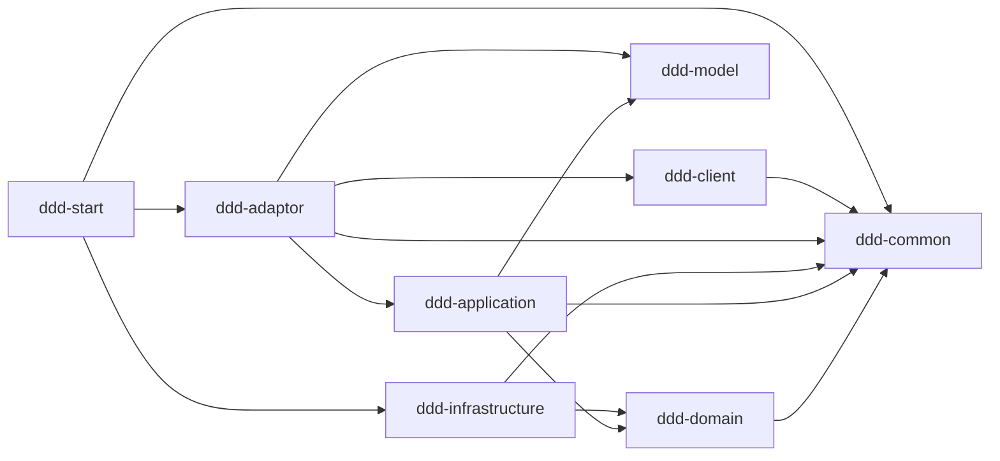
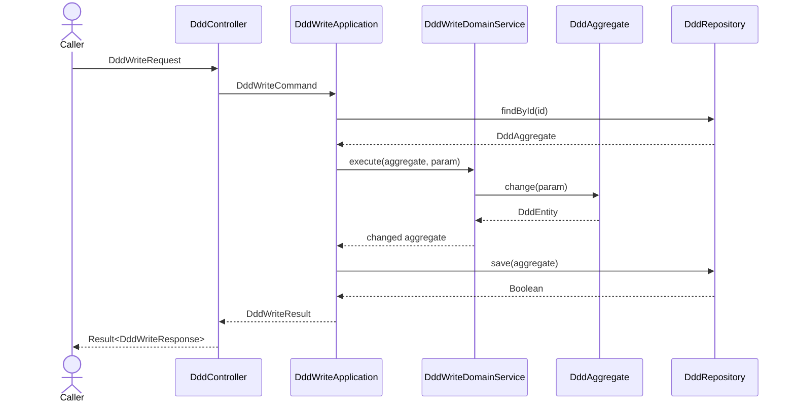

# 技术方案：Java DDD 公共代码规范模板

## 1. 背景与价值

### 1.1 背景

本工程用于验证并沉淀 Java DDD 代码规范，不实现任何真实业务。所有领域类型使用 `Ddd*` 中性占位符，表达“这个位置应放什么职责”，而不表达业务含义。后续生成真实项目时，必须根据领域语言替换前缀并重新建模，例如：

| 模板占位类型 | 订单查询项目示例 | 替换规则 |
|---|---|---|
| `DddController` | `OrderController` | 按接口资源命名 |
| `DddReadApplication` | `OrderReadApplication` | 按业务对象和用例模式命名 |
| `DddWriteDomainService` | `OrderWriteDomainService` | 按跨实体领域行为命名 |
| `DddAggregate` | `OrderAggregate` | 按聚合边界命名 |
| `DddEntity` | `OrderItemEntity` | 按实体语义命名 |
| `DddRepository` | `OrderRepository` | 每个聚合根一个领域仓储端口 |
| `DddRepositoryImpl` | `OrderRepositoryImpl` | 基础设施实现与端口对应 |
| `DddOutputAdaptor` | `OrderOutputAdaptor` | 按外部能力而非供应商命名 |

Spring Boot 启动类固定为 `Application`，不参与上述前缀替换，以避免与 application 层用例类产生含义冲突。

### 1.2 预期价值

| 价值 | 说明 | 验证方式 |
|---|---|---|
| 业务价值 | 新需求可以从统一骨架开始，减少分层、命名和调用方向的重复讨论。 | 用真实领域名替换 `Ddd*` 后，调用链仍完整且职责清晰。 |
| 技术价值 | 固化 Maven 模块边界、DDD 四种模式、Spring 装配、MyBatis-Plus 仓储及 input/output adaptor 规范。 | Reactor 构建、自动化测试和依赖扫描通过。 |
| 模板价值 | 示例不绑定一个虚构业务，避免后续模型复制无关概念。 | 当前代码和主设计文档不存在具体案例术语。 |

## 2. 调研推演与核心矛盾

### 2.1 已确认约束

| ID | 约束 | 设计结论 |
|---|---|---|
| TECH-001 | `common`、`client`、`model`、`domain`、`application`、`infrastructure`、`adaptor`、`start` 是独立 Maven module。 | 根工程只聚合和管理依赖；模块名和 `artifactId` 均使用 `ddd-` 前缀。 |
| TECH-002 | domain 必须保持框架无关。 | domain 不依赖 Spring/Jakarta；自定义 `@DomainService` 由 start 定向扫描。 |
| TECH-003 | application 负责编排，不承载领域状态变化。 | application 仅组装命令为领域 Param，并通过单一构造器注入领域服务；写逻辑委托 domain service、聚合根实体和领域仓储。 |
| TECH-004 | 仓储查询直接返回聚合根，保存返回 `Boolean`。 | domain 只声明端口；infrastructure 使用 MyBatis-Plus 实现。 |
| TECH-005 | 基础 CRUD 应复用 MyBatis-Plus，禁止自定义 SQL。 | `DddBaseRepository` 继承 `CrudRepository`，父类已通过 `@Autowired` 注入 Mapper，基类和子仓储不重复声明 Mapper 构造器；`DddMapper` 继承 `BaseMapper`，不写 XML 或 SQL 注解。 |
| TECH-006 | 类和注释需要形成可复制规范。 | aggregate/entity/param/value 使用明确后缀；类型、字段和公开契约使用多行中文 Javadoc，每个 Javadoc 含 `@author`；流程编排方法额外使用编号行内注释；本模板作者统一为 `AIGenerator`。 |
| TECH-007 | 示例需覆盖完整层级，而不是只展示一条链路。 | 独立展示写、域内读、规则+计算、纯计算，以及外部读 output adaptor。 |
| TECH-008 | 代码模板不得携带虚构业务。 | 统一使用 `Ddd*` 占位命名和 `id/value/ruleCode` 等中性字段。 |
| TECH-009 | 版本管理必须集中。 | 根 POM 管理工程版本、Spring Boot parent、MyBatis-Plus BOM、`ddd-*` 模块依赖与插件版本；子模块 dependency/plugin 不声明版本。子模块 parent 版本是 Maven 必需字段。 |
| TECH-010 | 代码与依赖声明应便于阅读。 | POM 中每个 dependency 单独使用多行元素；Java import 每行一个，按标准库、第三方、项目内、静态导入分组排序；Java 行宽不超过 120 字符，方法签名一行放得下时不提前换行。 |
| TECH-011 | 模型字段含义应能从源码直接理解。 | PO 与聚合状态字段用中文 Javadoc 说明用途、表列映射或不变量；record 组件在类 Javadoc 中逐项使用 `@param`；PO getter/setter 禁止单行压缩写法。注释均带作者标签。 |
| TECH-012 | Spring 组件注入方式需统一。 | 所有有依赖的 Spring 组件使用单一构造器注入，不标注 `@Autowired`；domain 无 Spring 依赖，领域服务通过 `@DomainService` 定向扫描，单一构造器注入领域端口。MyBatis-Plus `CrudRepository` 的 Mapper 注入由框架基类管理。 |
| TECH-013 | 输入防腐层的注释与二方包接口应清晰。 | Controller 的每个 HTTP 入口方法均使用中文 Javadoc 说明用途、参数、响应和作者；当前 HTTP 暴露不额外生成接口。若未来增加 RPC 协议，在 `ddd-client` 声明供外部依赖的接口及契约注释，由 `ddd-adaptor/input` 实现。 |
| TECH-014 | 主聚合的仓储链路应最小且完整。 | 主聚合只使用一张 `ddd_data` 表、一个 `DddPO`、一个 `DddMapper` 和一个领域仓储实现；领域实体仍由聚合持有，操作记录以 `entities_json` 同行保存。规则链路独立建模，不属于该聚合的实体明细。 |
| TECH-015 | 规则+计算链路不能依赖内存式仓储。 | 删除两个 `InMemoryDdd*Repository`；以 `DddRuleRepositoryImpl → DddBaseRepository → DddRuleMapper → DddRulePO → ddd_rule` 形成正式查询链。运行环境只建空表，不预置演示规则；不存在的规则明确返回领域校验错误。 |
| TECH-016 | 不为无状态转换器和单纯取当前时间建立手动 Bean 配置。 | `DddInputAssembler` 直接标记 `@Component`，由已有包扫描注册；写入时使用 `Instant.now()`，删除无其他职责的 `DddConfiguration`。若未来需固定时间或多时区策略，再单独引入可替换时钟。 |
| TECH-017 | 启动模块需要可直接加载的日志配置样例。 | `ddd-start/src/main/resources/logback-spring.xml` 默认只输出控制台；启用 `prod` 时增加文件滚动。UTC 时间、UTF-8、线程、级别、日志类和 MDC `traceId` 使用统一格式，`LOG_DIR`、`ROOT_LOG_LEVEL` 可由环境变量覆盖；不记录完整请求体。 |
| TECH-018 | 写聚合只作为根实体的容器，状态与行为必须由实体内聚。 | `DddAggregate` 仅持有 `DddEntity` 根实体；根实体持有 id、当前值、版本和 `DddOperationEntity` 子实体，并执行幂等校验、确认、累计和版本递增。`DddWriteParam` 仅携带输入聚合；待处理操作使用显式 pending 状态。 |
| TECH-019 | 所有层使用同一个框架无关的 `Result<T>`，错误码按模块枚举定义。 | `ddd-common` 提供 `Result<T>`、`ErrorCode`、`BaseException`；domain、application、infrastructure、adaptor 分别定义自己的 ErrorCode 枚举。仅存在私有抛出需求的 domain、infrastructure、adaptor 定义异常子类；领域服务与 output adaptor 的公开入口负责一次性捕获、日志和结果转换；Application 只检查与映射结果。 |
| TECH-020 | 流程编排不得绕过聚合或压缩为嵌套调用链。 | DomainService 只通过 Aggregate 的语义方法与根 Entity 协作；Controller、Application、DomainService、Adaptor、Repository 等多职责方法必须按“获取/组装 → 调用 → 解析/转换”拆分局部变量，并用 `// 1.`、`// 2.` 编号行内注释标明步骤。 |

### 2.2 核心矛盾与取舍

| 矛盾 | 取舍 | 原因 |
|---|---|---|
| 模板需要可运行，但不应假装是真实领域。 | 使用中性数据结构和可验证行为，只示范职责、边界和调用方向。 | 避免模型在真实项目中机械复制错误业务。 |
| 四种模式容易被合并成一个“万能服务”。 | 每种模式保留独立 application 入口和结果类型。 | 让调用路径可直接对照规范。 |
| domain service 需要被 Spring 装配，但 domain 不应依赖 Spring。 | domain 使用自定义标记注解，start 负责扫描；领域服务只声明一个普通 Java 构造器，由 Spring 注入领域端口。 | 保持领域层纯净，并获得构造器注入的显式依赖关系。 |
| 基础 CRUD 便利性与领域仓储抽象可能混淆。 | domain 仓储表达聚合语义；infrastructure 内部复用 MyBatis-Plus `CrudRepository`。 | 不让 ORM 类型泄漏到 domain。 |
| “纯计算”容易误接仓储或聚合。 | 纯计算仅接收值并调用 `DddCalculateDomainService`。 | 无状态计算不应创建虚假持久化依赖。 |

## 3. 整体方案

### 3.1 模块架构与依赖方向



- `ddd-common`：唯一的 `Result<T>`、`ErrorCode` 和 `BaseException`，不含 HTTP、Spring 或第三方协议。
- `ddd-client`：公开请求、响应，不包含业务实现或通用 Result；只有真实提供 RPC 能力时才增加带完整 Javadoc 契约的二方包接口。
- `ddd-model`：跨 application/output 边界使用的内部稳定模型。
- `ddd-domain`：聚合、实体、值对象、参数、领域服务和仓储端口。
- `ddd-application`：用例编排、事务边界候选和外部能力端口。
- `ddd-infrastructure`：PO、Mapper、基础 CRUD repository 和领域仓储实现。
- `ddd-adaptor`：HTTP input、assembler、异常映射，以及外部系统 output、converter、第三方响应模型。
- `ddd-start`：启动类、Spring/MyBatis-Plus 装配、配置、schema 和跨模块集成测试。

`ddd-start` 只做组装，业务模块不得反向依赖 `ddd-start`。业务调用方向与 Maven 依赖方向不是同一个概念：运行时 repository 实现被注入 domain 端口，但编译时只有 infrastructure 依赖 domain。

### 3.2 模块内目录规范

```text
ddd-client/src/main/java/com/ddd/client/ddd/{request,response}
ddd-model/src/main/java/com/ddd/model/ddd
ddd-domain/src/main/java/com/ddd/domain/ddd/{model,repository,service,exception}
ddd-application/src/main/java/com/ddd/application/ddd/{command,result,service,adaptor}
ddd-infrastructure/src/main/java/com/ddd/infrastructure/ddd/{mysql,repository}
ddd-adaptor/src/main/java/com/ddd/adaptor/ddd/{input,output}
ddd-start/src/main/java/com/ddd/start
```

### 3.3 五条参考调用链

| 模式 | 入口 | 调用链 | 核心边界 |
|---|---|---|---|
| 写模式 | `POST /api/ddd/write` | input → `DddWriteApplication` → `DddWriteDomainService` → `DddAggregate` → `DddRepository` | 状态只由聚合行为修改，application 不直接 set。 |
| 域内读 | `GET /api/ddd/{id}` | input → `DddReadApplication` → `DddRepository` | repository 直接返回聚合根，由 application 转为结果。 |
| 规则+计算 | `POST /api/ddd/rule` | input → `DddRuleApplication` → `DddRuleRepository` → `DddRuleAggregate` | 规则由仓储取得，规则聚合完成决策。 |
| 纯计算 | `POST /api/ddd/calculate` | input → `DddCalculateApplication` → `DddCalculateDomainService` | 不查询仓储、不创建聚合、不持久化。 |
| 外部读 | `GET /api/ddd/{id}/external` | input → `DddExternalReadApplication` → `DddOutputAdaptor` → output impl → converter → `DddModel` | application 定义端口，第三方模型不得进入 application/domain。 |

### 3.4 写模式时序



### 3.5 核心模型与数据

| ID | 类型 | 职责 |
|---|---|---|
| DATA-001 | `DddAggregate` | 仅持有 `DddEntity` 根实体，不维护独立状态或注入任何 Spring/仓储依赖。 |
| DATA-002 | `DddEntity` | 聚合根实体，维护 `id`、当前值、版本和多个 `DddOperationEntity` 子实体；所有状态变化均在本实体中执行。 |
| DATA-003 | `DddOperationEntity` | 单次操作子实体；待处理时保留原始值与规则编码，确认后补齐计算值和发生时间。 |
| DATA-004 | `DddIdValue`、`DddOperationIdValue`、`DddValue` | 在领域入口保证标识非空、数值合法，并封装计算。 |
| DATA-005 | `DddRuleAggregate` | 保存规则编码、因子和说明，并基于输入值完成规则计算。 |
| DATA-006 | `DddModel` | 承接外部数据经 converter 转换后的项目内部模型。 |
| DATA-007 | `ddd_data` | 主聚合唯一的 H2 示例表；同一行保存根实体主状态、版本和 `entities_json` 子操作实体快照。 |
| DATA-008 | `ddd_rule` | 规则聚合独立空表；保存 `rule_code`、`factor`、`reason`，运行期不预置样本，测试中按需插入。 |

### 3.6 核心伪代码

写模式：

```java
Result<DddWriteResponse> write(DddWriteRequest request) {
    DddWriteCommand command = inputAssembler.toCommand(request);
    return dddWriteApplication.execute(command).map(inputAssembler::toResponse);
}

Result<DddWriteResult> execute(DddWriteCommand command) {
    DddAggregate input = DddAggregate.draft(command.id(), command.operationId(),
        command.baseValue(), command.ruleCode());
    return dddWriteDomainService.execute(new DddWriteParam(input)).map(decision ->
        new DddWriteResult(command.id(), decision.operationId().value(),
            decision.value().value(), decision.currentValue().value(), decision.duplicate()));
}

Result<DddWriteDecision> execute(DddWriteParam param) {
  try {
    DddEntity inputEntity = param.aggregate().entity();
    DddOperationEntity pending = inputEntity.requiredPendingOperation();
    DddAggregate aggregate = dddRepository.findById(inputEntity.id());
    DddEntity entity = aggregate.entity();
    DddOperationEntity existing = entity.findOperation(pending.operationId()).orElse(null);
    if (existing != null) return Result.success(duplicate(existing, entity.currentValue()));
    DddRuleAggregate rule = dddRuleRepository.getRequiredByRuleCode(pending.ruleCode());
    DddValue calculated = rule.evaluate(new DddRuleParam(pending.ruleCode(), pending.baseValue()));
    DddOperationEntity confirmed = entity.confirm(pending, calculated, Instant.now());
    if (!Boolean.TRUE.equals(dddRepository.save(aggregate))) throw domainConflict();
    return Result.success(written(confirmed, entity.currentValue(), rule.reason()));
  } catch (DomainException exception) {
    log.warn("领域处理失败, code={}", exception.errorCode().code());
    return Result.failure(exception.errorCode());
  } catch (Exception exception) {
    log.error("领域处理发生未预期异常", exception);
    return Result.failure(DOMAIN_PROCESS_FAILED);
  }
}

DddAggregate findById(DddIdValue id) {
    DddPO stored = getById(id.value());
    if (stored == null) return DddAggregate.of(DddEntity.open(id));
    return DddAggregate.of(DddEntity.restore(id, new DddValue(stored.getCurrentValue()),
        stored.getVersion(), readOperationEntities(stored.getEntitiesJson())));
}

Boolean save(DddAggregate aggregate) {
    DddEntity entity = aggregate.entity();
    DddPO stored = getById(entity.id().value());
    if (stored == null) {
        return super.save(toDddPO(aggregate, entity.version()));
    }
    DddPO snapshot = toDddPO(aggregate, entity.version() - 1);
    return super.updateById(snapshot);
}
```

更新路径通过 MyBatis-Plus `@Version` 校验并推进根实体版本；根实体内的子操作实体列表在 `toDddPO` 中序列化为主表 JSON 快照。

当前 `write` 示例是“按 `operationId` 幂等的新增或更新”用例，领域服务必须先读取聚合，才能识别历史操作并防止重复写入。真实项目若存在不要求幂等校验的纯新增用例，应另设语义明确的 `create(DddWriteParam)` 领域服务方法：它直接初始化根 Entity 后保存，不应为了复用本示例而无意义地先查询。

域内读、规则计算和纯计算：

```java
Result<DddReadResult> query(String id) {
    try {
        DddAggregate aggregate = dddRepository.findById(DddAggregate.idOf(id));
        return Result.success(toView(aggregate));
    } catch (DomainException exception) {
        return Result.failure(exception.errorCode());
    }
}

Result<DddRuleResult> execute(DddRuleCommand command) {
    return dddRuleDomainService.execute(command.ruleCode(), command.baseValue())
        .map(decision -> new DddRuleResult(decision.ruleCode(), decision.factor(),
            decision.calculatedValue().value(), decision.reason()));
}

DddRuleAggregate getRequiredByRuleCode(String ruleCode) {
    DddRulePO stored = getById(ruleCode);
    if (stored == null) throw new DomainException(DOMAIN_RULE_NOT_FOUND);
    return new DddRuleAggregate(stored.getRuleCode(), stored.getFactor(), stored.getReason());
}

Result<DddCalculateResult> execute(DddCalculateCommand command) {
    return calculateDomainService.calculate(command.baseValue(), command.factor())
        .map(value -> new DddCalculateResult(value.value()));
}
```

域内读由 `toView` 转换聚合内实体；纯计算不访问 repository 或 aggregate。

外部读：

```java
Result<DddExternalResult> query(String id) {
    return outputAdaptor.queryById(id)
        .map(model -> new DddExternalResult(model.id(), model.name(), model.category()));
}

Result<DddModel> queryById(String id) {
    try {
        return Result.success(converter.toModel(invokeRemote(id)));
    } catch (AdaptorException exception) {
        log.warn("外部调用失败, code={}", exception.errorCode().code());
        return Result.failure(exception.errorCode());
    }
}
```

### 3.7 API 合约

| ID | 方法与路径 | 请求/响应 | 用途 |
|---|---|---|---|
| API-001 | `POST /api/ddd/write` | `DddWriteRequest` → `Result<DddWriteResponse>` | 写模式和聚合持久化。 |
| API-002 | `GET /api/ddd/{id}` | 路径 ID → `Result<DddReadResponse>` | 域内聚合读取。 |
| API-003 | `POST /api/ddd/rule` | `DddRuleRequest` → `Result<DddRuleResponse>` | 规则聚合计算。 |
| API-004 | `POST /api/ddd/calculate` | `DddCalculateRequest` → `Result<DddCalculateResponse>` | 无状态纯计算。 |
| API-005 | `GET /api/ddd/{id}/external` | 路径 ID → `Result<DddExternalReadResponse>` | output adaptor 和模型转换。 |

这些 API 只用于展示调用模式，不是建议真实项目公开 `/api/ddd`。真实项目必须按资源、动作和版本策略重新设计 API。

### 3.8 持久化与 Spring 装配

- 主聚合的 `DddMapper` 继承 `DddBaseMapper<DddPO> → BaseMapper<DddPO>`；规则表另有 `DddRuleMapper`。
- `DddBaseRepository<M, T>` 只继承 `CrudRepository<M, T>`；父类的 `baseMapper` 已由 Spring `@Autowired`，不自定义初始化构造器。
- `DddRepositoryImpl` 实现 domain `DddRepository`，继承基础仓储 CRUD；负责 `DddPO` 与“聚合容器 → 根实体 → 子操作实体”之间的重建、JSON 快照读写及乐观锁判断。
- `DddRuleRepositoryImpl` 实现 domain `DddRuleRepository`，同样继承基础仓储 CRUD；通过 `getById` 查询 `ddd_rule`，将 `DddRulePO` 转换为 `DddRuleAggregate`，不编写自定义 SQL。
- `DddPO` 对应单表 `ddd_data`：`id`、`current_value`、`version`、`entities_json`；前三列映射根实体状态，JSON 映射根实体持有的子操作实体。真实项目需依据查询、索引、容量和迁移要求决定是否拆表。
- `DddRulePO` 对应独立的 `ddd_rule` 空表：`rule_code`、`factor`、`reason`。运行环境无演示数据；真实需求必须提供规则来源或规则配置流程，测试仅在测试环境插入规则样本。
- Mapper 由 `Application` 上的 `@MapperScan` 集中注册；不得逐个添加自定义 SQL 注解或 XML SQL。
- Controller、application、output adaptor、infrastructure repository 的显式依赖全部采用单一构造器注入；application 使用 `@Service`，output 实现使用 `@Component`。
- `DddRepositoryImpl` 通过构造器获取 `ObjectMapper`；Mapper 注入沿用 MyBatis-Plus 父类已有的 `@Autowired`，不重复声明 Mapper 构造器。
- 无状态 `DddInputAssembler` 在 adaptor/input 直接使用 `@Component`；写 application 直接取得 `Instant.now()`，不再以 `DddConfiguration` 手动注册组装器或时钟。
- domain 不依赖 Spring。自定义 `@DomainService` 是领域语义标记，由 `DomainServiceScanConfiguration` 在 start 中扫描；带依赖的领域服务使用单一普通构造器接收领域端口，Spring 自动完成装配。

### 3.9 异常、观测、兼容与回滚

| 维度 | 方案 |
|---|---|
| 参数校验 | request 负责接口格式校验；value/param 再校验领域不变量；统一异常处理转换为 `Result`。 |
| 结果与异常 | `Result<T>` 位于 `ddd-common`，所有模块使用同一类型。`DomainErrorCode`、`ApplicationErrorCode`、`InfrastructureErrorCode`、`AdaptorErrorCode` 均为各自模块枚举并实现 `ErrorCode`。存在私有抛出需求的模块使用 `BaseException` 子类；领域服务和 output adaptor 的公开方法负责捕获、一次日志和 `Result.failure` 转换。 |
| 一致性 | 同一 `operationId` 在聚合内幂等；完整实体快照和主状态由同一行保存，写 application 已使用 `@Transactional`，版本更新由 MyBatis-Plus `@Version` 校验。正式项目应按并发和 JSON 容量风险补约束与冲突处理。 |
| 日志 | 模板的 `logback-spring.xml` 默认仅控制台输出；`prod` 额外输出按日期与 50MB 大小滚动的文件，保留 14 天、总量上限 2GB，默认目录为 `logs/`。DomainService 与 OutAdaptor 的主调用入口记录一次 `warn/error`；外部原始错误码、报文与堆栈仅入日志，Result 只返回项目内部错误码。 |
| 指标 | 建议记录每个用例的成功/失败/重复计数、延迟分位数、外部调用错误率和数据库冲突率。模板工程暂不绑定监控 SDK。 |
| 外部调用 | 当前 output 返回确定性的模拟响应；真实实现应补超时、重试上限、熔断或降级，并保持 converter 隔离。 |
| 安全 | 模板不实现真实鉴权；生产项目必须在 input 边界补身份、权限、数据范围和审计策略。 |
| 兼容 | 请求新增字段默认可选，响应只做向后兼容扩展；持久化变更遵循先扩后缩。 |
| 回滚 | 各 adaptor 和 repository 实现可独立替换；数据库变更采用可回滚迁移；新链路通过开关或路由停用。当前 H2 数据为临时测试数据。 |

### 3.10 验证方案

| 层级 | 验证内容 |
|---|---|
| 开发自测 | Maven Reactor 构建；聚合幂等与状态变化；五条接口链路；H2/MyBatis-Plus CRUD；domain 无 Spring/Jakarta；无自定义 SQL。 |
| 代码审查 | 模块依赖方向、业务逻辑归属、模型转换、命名后缀、多行中文 Javadoc 及作者标签、异常与并发边界。 |
| 独立测试 | 根据未来真实需求另行设计功能、兼容、并发和性能用例；不得把本模板自测直接当作业务验收。 |

## 4. 事项边界与交付清单

| 事项 | 本次交付 | 不在本次范围 |
|---|---|---|
| 工程结构 | 8 个 `ddd-*` Maven 子模块、根 POM、启动装配和依赖边界。 | 生产注册中心、配置中心、容器和部署脚本。 |
| 代码模式 | 写、域内读、规则+计算、纯计算、外部读及其所需 package。 | 任意真实业务规则、真实第三方协议和生产 API。 |
| 数据访问 | MyBatis-Plus 基础仓储、Mapper、PO、H2 schema 和乐观锁示意。 | MySQL 迁移脚本、分库分表、生产索引和容量设计。 |
| 质量 | 中文 Javadoc、领域单测、MockMvc 集成测试和开发自测记录。 | 独立 CR 结论、真实业务验收和性能基准。 |
| 模板沉淀 | 本项目作为后续代码规范输入。 | 未经用户确认不直接修改公共 `solo-delivery` Skill。 |

假设：未来项目会保留相同分层思想，但允许按真实复杂度删减不适用模式；“完整模板”不等于每个项目必须生成全部类。

## 5. 工时与人天评估

| 工作项 | 估算（人天） | 说明 |
|---|---:|---|
| DDD 规范映射与技术设计 | 0.5 | 包含边界、命名和伪代码确认。 |
| Maven 多模块骨架与装配 | 0.5 | 8 个子模块、依赖管理和启动配置。 |
| 五条调用链与持久化示例 | 1.5 | 包含 input/output、domain、application、MyBatis-Plus 和 H2。 |
| 自动化测试与开发自测 | 0.5 | 包含领域、集成和静态约束检查。 |
| CR 与模板收敛 | 0.5 | 不含真实业务建模或生产基础设施。 |
| **合计** | **3.5** | 参考工程估算；真实项目必须依据需求另行评估。 |

---

### 决策与变更记录

| 版本 | 时间 | 变化 | 原因 |
|---|---|---|---|
| 0.2 | 2026-09-14 | 生成以伪代码为核心的聚合式技术方案。 | 验证技术文档表达方式。 |
| 0.7 | 2026-09-15 | 固化 7 个 `ddd-*` Maven 子模块、Spring 装配和 MyBatis-Plus/H2。 | 落实多模块和持久化规范。 |
| 0.8 | 2026-09-15 | 仓储改为聚合根直返与 `Boolean` 保存，增加基础 CRUD repository 和中文 Javadoc。 | 落实仓储与注释规范。 |
| 0.9 | 2026-09-15 | 补齐四种 DDD 模式及外部读 output adaptor。 | 覆盖参考工程所有主要 package。 |
| 1.0 | 2026-09-15 | 删除具体业务案例，统一为可替换的 `Ddd*` 中性占位符，并纠正纯计算模式的依赖边界。 | 使代码真正适合作为公共模板，而非虚构业务实现。 |
| 1.1 | 2026-09-15 | 将单行类注释统一改为多行 Javadoc，并为所有源码注释增加 `@author AIGenerator`。 | 落实可复制的注释格式和作者标识规范。 |
| 1.2 | 2026-09-15 | 将模块依赖版本纳入根 POM 管理，统一多行 dependency 声明和 Java import 分组格式。 | 落实集中版本管理和代码可读性要求。 |
| 1.3 | 2026-09-15 | 补齐 PO、聚合字段和 record 组件含义，并展开 PO getter/setter。 | 让参考工程的数据模型可直接从源码理解。 |
| 1.4 | 2026-09-15 | Spring 容器依赖统一使用显式 `@Autowired`，普通组件采用字段注入，MyBatis-Plus 基类仓储保留显式构造器注入。 | 固化用户选择的注入约定并保留 domain 无框架边界。 |
| 1.5 | 2026-09-15 | Controller 五个 HTTP 入口统一补齐方法 Javadoc，约定未来 RPC 二方包接口的详细契约注释。 | 统一输入防腐层可读性与对外接口规范。 |
| 1.6 | 2026-09-15 | 合并四处无需换行的方法/构造器签名，并明确 120 字符截止线。 | 保持代码紧凑，避免无意义的参数换行。 |
| 1.7 | 2026-09-15 | 参考 itineary 收敛为单表仓储样例，移除重复 Mapper 构造器及第二套 PO/Mapper/Repository，实体记录改为主表 JSON 快照；修正写入伪代码。 | 减少公共模板的继承与持久化样板，同时保留领域实体、幂等和乐观锁示例。 |
| 1.8 | 2026-09-15 | 删除两个内存仓储，规则聚合改走独立空表及 MyBatis-Plus 仓储链；澄清单表约束仅适用于主聚合。 | 使规则+计算模式也能作为真实仓储结构参考，而不是靠硬编码内存数据运行。 |
| 1.9 | 2026-09-15 | `DddInputAssembler` 改为组件扫描，写入时间直接取 `Instant.now()`，删除仅含两个普通 Bean 的 `DddConfiguration`。 | 避免给公共模板增加无必要的手动 Spring 配置。 |
| 2.0 | 2026-09-15 | 补充 `logback-spring.xml`：默认控制台日志、`prod` 滚动文件日志、可配置目录和级别；明确 MDC traceId 尚未由请求链路填充。 | 让启动工程包含可用且边界清楚的日志规范模板。 |
| 2.1 | 2026-09-15 | 所有 Spring 组件改用单一构造器注入；写聚合仅持有根 `DddEntity`，根实体持有并确认 `DddOperationEntity`；写领域服务负责领域仓储的加载与保存。 | 让依赖关系可见，且将状态变化收敛至实体，同时保持 domain 无 Spring API。 |
| 2.2 | 2026-09-15 | 写 Application 不再创建或读取 Value Object；改由 `DddAggregate.draft` 委托根实体完成输入模型封装。 | 避免应用层侵入领域值对象和子实体构造规则。 |
| 2.3 | 2026-09-15 | 新增 `ddd-common`，全链路使用统一 `Result<T>`；按模块建立错误码枚举和异常类型，领域服务与 OutAdaptor 在公开入口完成异常转换；Application 不再向 Controller 泄漏 `DddModel`。 | 统一上层错误判断、保障日志可追溯，同时保持模块依赖方向和防腐层边界。 |
| 2.4 | 2026-09-15 | 写领域服务改为只调用 Aggregate 语义方法；所有分层编排方法拆解为显式步骤并添加编号行内注释。 | 避免跨越聚合直接操作 Entity 以及压缩调用链造成过程式、难审查的代码。 |
