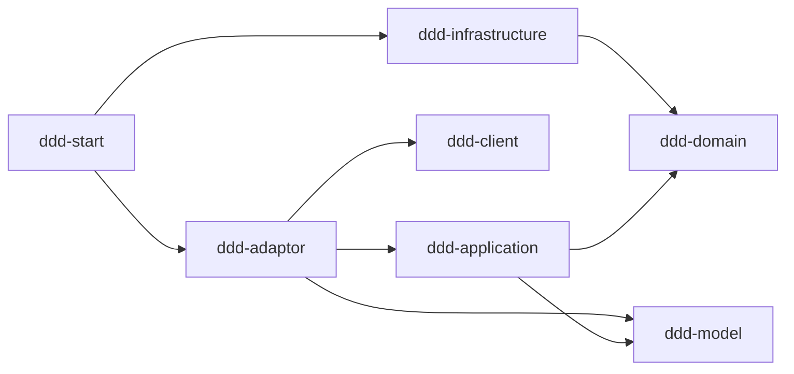
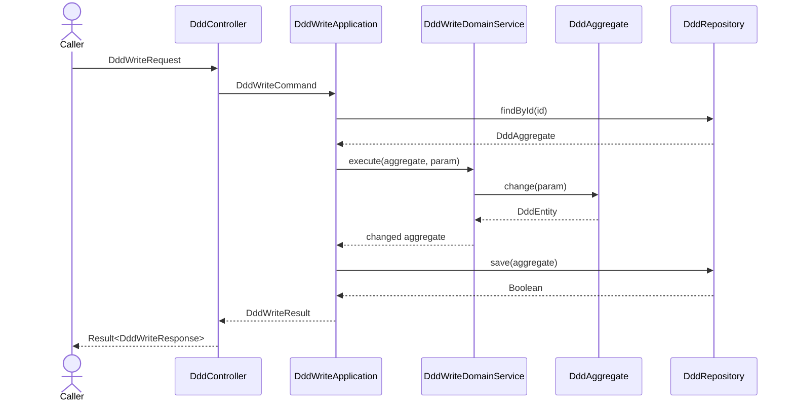

# 技术方案：Java DDD 公共代码规范模板

## 1. 背景与价值

### 1.1 背景

本工程用于验证并沉淀 Java DDD 代码规范，不实现任何真实业务。所有领域类型使用 `Ddd*` 中性占位符，表达“这个位置应放什么职责”，而不表达业务含义。后续生成真实项目时，必须根据领域语言替换前缀并重新建模，例如：

| 模板占位类型 | 订单查询项目示例 | 替换规则 |
|---|---|---|
| `DddController` | `OrderController` | 按接口资源命名 |
| `DddReadApplication` | `OrderReadApplication` | 按业务对象和用例模式命名 |
| `DddWriteDomainService` | `OrderWriteDomainService` | 按跨实体领域行为命名 |
| `DddAggregate` | `OrderAggregate` | 按聚合边界命名 |
| `DddEntity` | `OrderItemEntity` | 按实体语义命名 |
| `DddRepository` | `OrderRepository` | 每个聚合根一个领域仓储端口 |
| `DddRepositoryImpl` | `OrderRepositoryImpl` | 基础设施实现与端口对应 |
| `DddOutputAdaptor` | `OrderOutputAdaptor` | 按外部能力而非供应商命名 |

Spring Boot 启动类固定为 `Application`，不参与上述前缀替换，以避免与 application 层用例类产生含义冲突。

### 1.2 预期价值

| 价值 | 说明 | 验证方式 |
|---|---|---|
| 业务价值 | 新需求可以从统一骨架开始，减少分层、命名和调用方向的重复讨论。 | 用真实领域名替换 `Ddd*` 后，调用链仍完整且职责清晰。 |
| 技术价值 | 固化 Maven 模块边界、DDD 四种模式、Spring 装配、MyBatis-Plus 仓储及 input/output adaptor 规范。 | Reactor 构建、自动化测试和依赖扫描通过。 |
| 模板价值 | 示例不绑定一个虚构业务，避免后续模型复制无关概念。 | 当前代码和主设计文档不存在具体案例术语。 |

## 2. 调研推演与核心矛盾

### 2.1 已确认约束

| ID | 约束 | 设计结论 |
|---|---|---|
| TECH-001 | `client`、`model`、`domain`、`application`、`infrastructure`、`adaptor`、`start` 是独立 Maven module。 | 根工程只聚合和管理依赖；模块名和 `artifactId` 均使用 `ddd-` 前缀。 |
| TECH-002 | domain 必须保持框架无关。 | domain 不依赖 Spring/Jakarta；自定义 `@DomainService` 由 start 定向扫描。 |
| TECH-003 | application 负责编排，不承载领域状态变化。 | application 类使用 Spring `@Service` 和构造器注入；写逻辑委托 domain service/aggregate。 |
| TECH-004 | 仓储查询直接返回聚合根，保存返回 `Boolean`。 | domain 只声明端口；infrastructure 使用 MyBatis-Plus 实现。 |
| TECH-005 | 基础 CRUD 应复用 MyBatis-Plus，禁止自定义 SQL。 | `DddBaseRepository` 继承 `CrudRepository`；Mapper 继承 `BaseMapper`，不写 XML 或 SQL 注解。 |
| TECH-006 | 类和注释需要形成可复制规范。 | aggregate/entity/param/value 使用明确后缀；所有源码注释使用中文 Javadoc。 |
| TECH-007 | 示例需覆盖完整层级，而不是只展示一条链路。 | 独立展示写、域内读、规则+计算、纯计算，以及外部读 output adaptor。 |
| TECH-008 | 代码模板不得携带虚构业务。 | 统一使用 `Ddd*` 占位命名和 `id/value/ruleCode` 等中性字段。 |

### 2.2 核心矛盾与取舍

| 矛盾 | 取舍 | 原因 |
|---|---|---|
| 模板需要可运行，但不应假装是真实领域。 | 使用中性数据结构和可验证行为，只示范职责、边界和调用方向。 | 避免模型在真实项目中机械复制错误业务。 |
| 四种模式容易被合并成一个“万能服务”。 | 每种模式保留独立 application 入口和结果类型。 | 让调用路径可直接对照规范。 |
| domain service 需要被 Spring 装配，但 domain 不应依赖 Spring。 | domain 使用自定义标记注解，start 负责扫描。 | 保持领域层纯净，并支持运行时装配。 |
| 基础 CRUD 便利性与领域仓储抽象可能混淆。 | domain 仓储表达聚合语义；infrastructure 内部复用 MyBatis-Plus `CrudRepository`。 | 不让 ORM 类型泄漏到 domain。 |
| “纯计算”容易误接仓储或聚合。 | 纯计算仅接收值并调用 `DddCalculateDomainService`。 | 无状态计算不应创建虚假持久化依赖。 |

## 3. 整体方案

### 3.1 模块架构与依赖方向



- `ddd-client`：公开请求、响应和 `Result<T>`，不包含业务实现。
- `ddd-model`：跨 application/output 边界使用的内部稳定模型。
- `ddd-domain`：聚合、实体、值对象、参数、领域服务和仓储端口。
- `ddd-application`：用例编排、事务边界候选和外部能力端口。
- `ddd-infrastructure`：PO、Mapper、基础 CRUD repository 和领域仓储实现。
- `ddd-adaptor`：HTTP input、assembler、异常映射，以及外部系统 output、converter、第三方响应模型。
- `ddd-start`：启动类、Spring/MyBatis-Plus 装配、配置、schema 和跨模块集成测试。

`ddd-start` 只做组装，业务模块不得反向依赖 `ddd-start`。业务调用方向与 Maven 依赖方向不是同一个概念：运行时 repository 实现被注入 domain 端口，但编译时只有 infrastructure 依赖 domain。

### 3.2 模块内目录规范

```text
ddd-client/src/main/java/com/ddd/client/ddd/{request,response}
ddd-model/src/main/java/com/ddd/model/ddd
ddd-domain/src/main/java/com/ddd/domain/ddd/{model,repository,service,exception}
ddd-application/src/main/java/com/ddd/application/ddd/{command,result,service,adaptor}
ddd-infrastructure/src/main/java/com/ddd/infrastructure/ddd/{mysql,repository}
ddd-adaptor/src/main/java/com/ddd/adaptor/ddd/{input,output}
ddd-start/src/main/java/com/ddd/start
```

### 3.3 五条参考调用链

| 模式 | 入口 | 调用链 | 核心边界 |
|---|---|---|---|
| 写模式 | `POST /api/ddd/write` | input → `DddWriteApplication` → `DddWriteDomainService` → `DddAggregate` → `DddRepository` | 状态只由聚合行为修改，application 不直接 set。 |
| 域内读 | `GET /api/ddd/{id}` | input → `DddReadApplication` → `DddRepository` | repository 直接返回聚合根，由 application 转为结果。 |
| 规则+计算 | `POST /api/ddd/rule` | input → `DddRuleApplication` → `DddRuleRepository` → `DddRuleAggregate` | 规则由仓储取得，规则聚合完成决策。 |
| 纯计算 | `POST /api/ddd/calculate` | input → `DddCalculateApplication` → `DddCalculateDomainService` | 不查询仓储、不创建聚合、不持久化。 |
| 外部读 | `GET /api/ddd/{id}/external` | input → `DddExternalReadApplication` → `DddOutputAdaptor` → output impl → converter → `DddModel` | application 定义端口，第三方模型不得进入 application/domain。 |

### 3.4 写模式时序



### 3.5 核心模型与数据

| ID | 类型 | 职责 |
|---|---|---|
| DATA-001 | `DddAggregate` | 维护 `id`、当前值、版本和实体集合；校验重复操作并执行一致性状态变化。 |
| DATA-002 | `DddEntity` | 记录一次中性操作的 `operationId`、值、规则编码和发生时间。 |
| DATA-003 | `DddIdValue`、`DddOperationIdValue`、`DddValue` | 在领域入口保证标识非空、数值合法，并封装计算。 |
| DATA-004 | `DddRuleAggregate` | 保存规则编码、因子和说明，并基于输入值完成规则计算。 |
| DATA-005 | `DddModel` | 承接外部数据经 converter 转换后的项目内部模型。 |
| DATA-006 | `ddd_data`、`ddd_entity` | H2 可运行示例表；分别保存聚合主状态和实体记录。 |

### 3.6 核心伪代码

写模式：

```java
Result<DddWriteResponse> write(DddWriteRequest request) {
    DddWriteCommand command = inputAssembler.toWriteCommand(request);
    DddWriteResult result = dddWriteApplication.execute(command);
    return Result.success(inputAssembler.toWriteResponse(result));
}

DddWriteResult execute(DddWriteCommand command) {
    DddAggregate aggregate = dddRepository.findById(command.id());
    DddWriteParam param = DddWriteParam.of(
        command.operationId(), command.ruleCode(), command.baseValue());
    dddWriteDomainService.execute(aggregate, param);
    if (!dddRepository.save(aggregate)) {
        throw new DomainValidationException("保存失败");
    }
    return DddWriteResult.from(aggregate);
}
```

域内读、规则计算和纯计算：

```java
DddReadResult read(String id) {
    return DddReadResult.from(dddRepository.findById(DddIdValue.of(id)));
}

DddRuleResult evaluate(DddRuleCommand command) {
    DddRuleAggregate rule = dddRuleRepository.findByCode(command.ruleCode());
    return DddRuleResult.from(rule.evaluate(DddRuleParam.of(command.baseValue())));
}

DddCalculateResult calculate(DddCalculateCommand command) {
    // 纯计算不访问 repository 或 aggregate。
    DddValue value = dddCalculateDomainService.calculate(
        command.baseValue(), command.factor());
    return new DddCalculateResult(value.value());
}
```

外部读：

```java
DddExternalResult readExternal(String id) {
    DddModel model = dddOutputAdaptor.queryById(id);
    return DddExternalResult.from(model);
}

DddModel queryById(String id) {
    DddExternalResponse remote = externalClientOrStub.query(id);
    return dddOutputConverter.toModel(remote);
}
```

### 3.7 API 合约

| ID | 方法与路径 | 请求/响应 | 用途 |
|---|---|---|---|
| API-001 | `POST /api/ddd/write` | `DddWriteRequest` → `Result<DddWriteResponse>` | 写模式和聚合持久化。 |
| API-002 | `GET /api/ddd/{id}` | 路径 ID → `Result<DddReadResponse>` | 域内聚合读取。 |
| API-003 | `POST /api/ddd/rule` | `DddRuleRequest` → `Result<DddRuleResponse>` | 规则聚合计算。 |
| API-004 | `POST /api/ddd/calculate` | `DddCalculateRequest` → `Result<DddCalculateResponse>` | 无状态纯计算。 |
| API-005 | `GET /api/ddd/{id}/external` | 路径 ID → `Result<DddExternalReadResponse>` | output adaptor 和模型转换。 |

这些 API 只用于展示调用模式，不是建议真实项目公开 `/api/ddd`。真实项目必须按资源、动作和版本策略重新设计 API。

### 3.8 持久化与 Spring 装配

- `DddMapper`、`DddEntityMapper` 继承 `DddBaseMapper<T> → BaseMapper<T>`。
- `DddEntityRepository` 继承 `DddBaseRepository<M> → CrudRepository<M>`，复用 MyBatis-Plus CRUD。
- `DddRepositoryImpl` 实现 domain `DddRepository`，负责 PO 与聚合之间的重建、保存和乐观锁判断。
- Mapper 由 `Application` 上的 `@MapperScan` 集中注册；不得逐个添加自定义 SQL 注解或 XML SQL。
- application 使用 `@Service` 和构造器注入；infrastructure 使用 `@Repository`；output 实现使用 `@Component`。
- domain 不依赖 Spring。自定义 `@DomainService` 是领域语义标记，由 `DomainServiceScanConfiguration` 在 start 中扫描。

### 3.9 异常、观测、兼容与回滚

| 维度 | 方案 |
|---|---|
| 参数校验 | request 负责接口格式校验；value/param 再校验领域不变量；统一异常处理转换为 `Result`。 |
| 一致性 | 同一 `operationId` 在聚合内幂等；聚合与实体由同一 application 用例保存；正式项目应补事务注解和数据库唯一约束。 |
| 日志 | 边界日志记录 traceId、调用模式、业务 ID、结果、耗时和异常类型；禁止记录完整敏感请求。 |
| 指标 | 建议记录每个用例的成功/失败/重复计数、延迟分位数、外部调用错误率和数据库冲突率。模板工程暂不绑定监控 SDK。 |
| 外部调用 | 当前 output 返回确定性的模拟响应；真实实现应补超时、重试上限、熔断或降级，并保持 converter 隔离。 |
| 安全 | 模板不实现真实鉴权；生产项目必须在 input 边界补身份、权限、数据范围和审计策略。 |
| 兼容 | 请求新增字段默认可选，响应只做向后兼容扩展；持久化变更遵循先扩后缩。 |
| 回滚 | 各 adaptor 和 repository 实现可独立替换；数据库变更采用可回滚迁移；新链路通过开关或路由停用。当前 H2 数据为临时测试数据。 |

### 3.10 验证方案

| 层级 | 验证内容 |
|---|---|
| 开发自测 | Maven Reactor 构建；聚合幂等与状态变化；五条接口链路；H2/MyBatis-Plus CRUD；domain 无 Spring/Jakarta；无自定义 SQL。 |
| 代码审查 | 模块依赖方向、业务逻辑归属、模型转换、命名后缀、中文 Javadoc、异常与并发边界。 |
| 独立测试 | 根据未来真实需求另行设计功能、兼容、并发和性能用例；不得把本模板自测直接当作业务验收。 |

## 4. 事项边界与交付清单

| 事项 | 本次交付 | 不在本次范围 |
|---|---|---|
| 工程结构 | 7 个 `ddd-*` Maven 子模块、根 POM、启动装配和依赖边界。 | 生产注册中心、配置中心、容器和部署脚本。 |
| 代码模式 | 写、域内读、规则+计算、纯计算、外部读及其所需 package。 | 任意真实业务规则、真实第三方协议和生产 API。 |
| 数据访问 | MyBatis-Plus 基础仓储、Mapper、PO、H2 schema 和乐观锁示意。 | MySQL 迁移脚本、分库分表、生产索引和容量设计。 |
| 质量 | 中文 Javadoc、领域单测、MockMvc 集成测试和开发自测记录。 | 独立 CR 结论、真实业务验收和性能基准。 |
| 模板沉淀 | 本项目作为后续代码规范输入。 | 未经用户确认不直接修改公共 `solo-delivery` Skill。 |

假设：未来项目会保留相同分层思想，但允许按真实复杂度删减不适用模式；“完整模板”不等于每个项目必须生成全部类。

## 5. 工时与人天评估

| 工作项 | 估算（人天） | 说明 |
|---|---:|---|
| DDD 规范映射与技术设计 | 0.5 | 包含边界、命名和伪代码确认。 |
| Maven 多模块骨架与装配 | 0.5 | 7 个子模块、依赖管理和启动配置。 |
| 五条调用链与持久化示例 | 1.5 | 包含 input/output、domain、application、MyBatis-Plus 和 H2。 |
| 自动化测试与开发自测 | 0.5 | 包含领域、集成和静态约束检查。 |
| CR 与模板收敛 | 0.5 | 不含真实业务建模或生产基础设施。 |
| **合计** | **3.5** | 参考工程估算；真实项目必须依据需求另行评估。 |

---

### 决策与变更记录

| 版本 | 时间 | 变化 | 原因 |
|---|---|---|---|
| 0.2 | 2026-09-14 | 生成以伪代码为核心的聚合式技术方案。 | 验证技术文档表达方式。 |
| 0.7 | 2026-09-15 | 固化 7 个 `ddd-*` Maven 子模块、Spring 装配和 MyBatis-Plus/H2。 | 落实多模块和持久化规范。 |
| 0.8 | 2026-09-15 | 仓储改为聚合根直返与 `Boolean` 保存，增加基础 CRUD repository 和中文 Javadoc。 | 落实仓储与注释规范。 |
| 0.9 | 2026-09-15 | 补齐四种 DDD 模式及外部读 output adaptor。 | 覆盖参考工程所有主要 package。 |
| 1.0 | 2026-09-15 | 删除具体业务案例，统一为可替换的 `Ddd*` 中性占位符，并纠正纯计算模式的依赖边界。 | 使代码真正适合作为公共模板，而非虚构业务实现。 |
