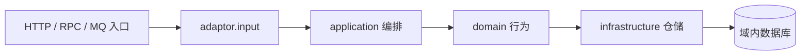
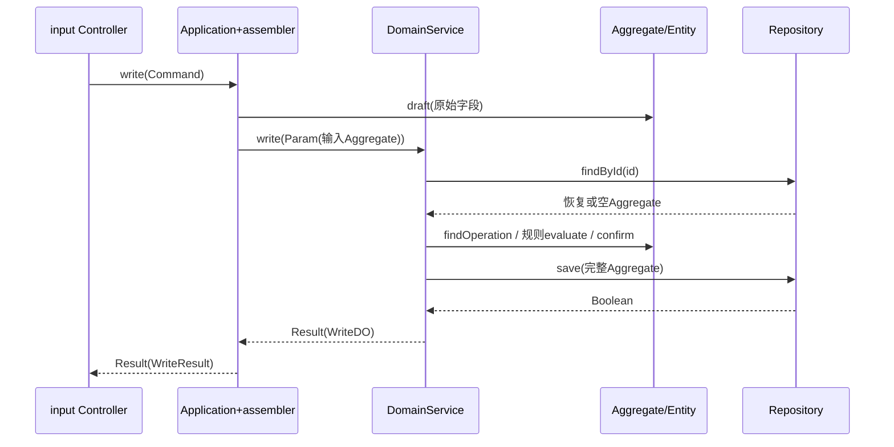

# 技术方案：Java DDD 参考工程与 solo 交付闭环

> 本版依据当前源码整理实现基线，将已被覆盖的历史选择移到归档。solo 0.8 重整未改变 Java/POM/Checkstyle；SRC-040/041轮清理注入注释且未改业务逻辑；当前SRC-043轮修订四层入口与写事务捕获/回滚及门禁，POM/资源未变。原技术审批记录保留，新整理版供阅读反馈。

## 1. 背景、目标与预期价值

ddd 已经完成多轮代码调整，目标是作为 solo 生成真实 Java DDD 工程的规范参考。旧技术文档采用“逐轮追加”，导致当前实现与早期伪代码、注入方式和模型描述并存；本次建立紧凑且能直接看懂代码的技术闭环。

业务价值：单人研发按明确材料与关口完成需求；技术价值：规则、模型、转换边界、仓储、错误及自动门禁一致。可观察结果是源码与规范可对照、构建证据可复现、阶段可接续，不是宣称生产价值已经实现。

范围：同步 solo 0.8 工作流及 ddd/AI/output 文档；机器状态升级配套。非目标：变更业务实现、扩充演示模式、生产配置、真实外部调用或执行 CR/发布。

## 2. 调研、推演与核心矛盾

| 问题 | 当前取舍 | 依据/设计 |
|---|---|---|
| 分层是否只是包目录 | 八个独立 Maven module，项目名前缀 | TECH-001；根和模块 POM |
| 领域模型与 Spring 耦合 | 构造器接收依赖，domain 自定义 DomainService 标记，start 定向扫描 | TECH-012/018；DomainServiceScanConfiguration |
| 聚合还是过程式字段处理 | Aggregate 仅持 Entity；实体内聚状态/Value，聚合提供语义入口 | TECH-003/018/020；DddAggregate/DddEntity |
| 跨层是否透传模型 | Request→Command→Param；DO→Application Result→Response | TECH-019/021/022/024；两层 assembler |
| 外部入参重复定义 | OutAdaptor 端口定义在 application，直接使用其 Command | TECH-021/022；DddOutputAdaptor |
| 通用 CRUD 与领域仓储混杂 | Domain 接口暴露聚合/ID；实现继承基础仓储，PO/ORM 留在 infrastructure | TECH-004/005/014/023 |
| 单表参考是否需要规则链路 | ddd_data 保存主聚合；ddd_rule 是规则聚合的独立空表 | TECH-015；不保留内存式仓储或第二套实体表 |
| 统一 Result 是否等于异常全部吞掉 | 主边界统一友好失败，私有方法不重复捕获，保留内部日志 | TECH-019；事务与错误映射仍需 CR |
| 子模块版本重复 | 根 revision；parent 用 revision；Flatten 解析安装 POM | TECH-027 |
| 文档完整是否必须文件多 | 主文档合并、阶段独立；开发计划默认嵌入 | TECH-028 / SRC-039 |

当前规则以 [19 Java DDD开发规范](<19 Java DDD开发规范.md>) 为准。TECH-001～027 原逐轮细节完整归档，已覆盖决策不再有效。使用 C/P/R 区分自动、部分和评审规则；Checkstyle 不验证完整依赖图、事务或领域建模。

## 3. 整体方案

### 3.1 架构、依赖与目录

以下是从左到右的运行调用，不是 Maven 依赖图；input 与 output 属于同一个 adaptor module。




| module | 内部直接依赖 | 关键包/职责 |
|---|---|---|
| ddd-common | 无 | common.result / common.error，统一协议 |
| ddd-client | common | client.ddd.request / response；按需 RPC 接口，禁止 model |
| ddd-model | 无 | model.ddd，内部无行为 DO |
| ddd-domain | common、model | annotation；ddd.model.aggregate/entity/param/value、service、repository、exception |
| ddd-application | common、domain、model | ddd.command/result/assembler/service/adaptor、exception |
| ddd-infrastructure | common、domain；传递获得 model | 基础 Mapper/Repository；ddd.mysql.mapper/pojo、repository、exception |
| ddd-adaptor | common、model、application、client | common 异常兜底；ddd.input/assembler、output/converter/model、exception |
| ddd-start | 其余七个实际运行模块 | Application；config.domain/database、日志、H2 schema 和集成测试 |

start 是显式装配清单，不是业务层；没有其他业务模块反向依赖 start。外部端口编译期属于 application，adaptor 实现它，因此运行箭头与编译依赖方向不同，不混画在同一张图。

真实项目仅使用需要的层与链路；项目名替换 module 前缀和 com.ddd，业务语义替换 Ddd。参考文件随 solo 包携带，不依赖用户机器原 ddd 路径。

### 3.2 模型与数据

| 模型 | 所在层 | 当前职责/约束 |
|---|---|---|
| DddWriteRequest / DddWriteResponse | client | 外部 HTTP 数据，不含 Domain/DO |
| DddWriteCommand / DddWriteResult | application | 用例入参/结果，独立防腐边界 |
| DddWriteParam | domain | 只包含 DddAggregate |
| DddAggregate | domain | 仅 DddEntity 属性；draft/findOperation/confirm 等语义入口 |
| DddEntity | domain | id、currentValue、version、子操作 Entity；状态变化和 Value 创建内聚 |
| DddOperationEntity | domain | 操作幂等 ID、待处理/已确认状态、数值及规则信息 |
| DddRuleAggregate / DddRuleEntity | domain | 聚合只持规则 Entity；Entity 校验规则并计算 |
| DddRuleParam / DddCalculateParam | domain | 规则与纯计算的对象参数；没有写状态时不虚构写聚合 |
| DddWriteDO / DddRuleCalculateDO / DddCalculateDO / DddExternalReadDO | model | 内部结果快照，无业务行为；不出现在 Controller 或 client |
| DddPO / DddRulePO | infrastructure | 表映射，禁止泄漏到其他层 |
| DddExternalRequest / DddExternalResponse | adaptor.output.model | converter/invokeRemote 私有外部协议，不是 app 的入出参 |

DATA-001：ddd_data(id 主键、current_value、version、entities_json)，一条主聚合的实体 JSON 快照。
DATA-007：ddd_rule(rule_code 主键、factor、reason)，运行环境无规则种子，测试单独写入样本。
实体多个不意味着必须每个 Entity 对应一张表；当前主聚合只有一张持久化表，规则聚合另有独立表。真实业务需评估关系表、快照大小、索引与历史数据策略。

### 3.3 入口契约与对象转换

| 层 | 约定公开签名 | 转换责任 |
|---|---|---|
| Controller | Result<XXResponse> action(@Valid @RequestBody XXRequest xxRequest) | input assembler 转 Command，返回时只转 Application Result |
| Application | Result<XXResult> action(XXCommand xxCommand) | application assembler 转 Domain Param、Domain/Out DO 或聚合到 Result |
| DomainService | Result<XXDO> action(XXParam param) | 主领域处理与内部结果；不染指外部 Response |
| OutAdaptor | Result<XXDO> action(XXCommand xxCommand) | converter 转第三方协议，再转内部 DO |

REST 路径/查询绑定可接基础类型，但 Controller 调 Application 前必须组装 Command。Repository 是明确例外：ID/IDs 可以基础标识，新增/修改接 Aggregate、返回 Boolean，查询返回 Aggregate 而非 Optional。分页有实际需求才定义域内模型并转换 ORM Page，不建占位实现。

### 3.4 写路径时序与伪代码



下面是与当前源码对齐的逻辑摘要；“构造 DO”等省略字段的语句是伪代码，不宣称可直接编译。

```java
// Controller：协议校验后分步获取参数、调用、解析。
public Result<DddWriteResponse> write(@Valid @RequestBody DddWriteRequest dddWriteRequest) {
    try {
        // 1. 协议请求转应用命令。
        DddWriteCommand dddWriteCommand = inputAssembler.toCommand(dddWriteRequest);
        // 2. 调用应用服务并传播标准失败。
        Result<DddWriteResult> applicationResult = writeApplication.write(dddWriteCommand);
        if (!applicationResult.success()) {
            return Result.failure(applicationResult.code(), applicationResult.message());
        }
        // 3. 只将应用结果转外部响应，不接触 DO。
        DddWriteResponse response = inputAssembler.toResponse(applicationResult.data());
        return Result.success(response);
    } catch (Exception exception) {
        return HttpResults.capture(exception);
    }
}

// Application assembler：不自行操作 Entity / Value。
DddWriteParam toDomainParam(DddWriteCommand command) {
    DddAggregate aggregate = DddAggregate.draft(
        command.id(), command.operationId(), command.baseValue(), command.ruleCode());
    return new DddWriteParam(aggregate);
}

// Application：主入口try涵盖TransactionTemplate.execute及提交。
Result<DddWriteResult> write(DddWriteCommand command) {
    try {
        return transactionTemplate.execute(status -> {
            DddWriteParam param = assembler.toDomainParam(command);
            Result<DddWriteDO> domainResult = domainService.write(param);
            if (!domainResult.success()) {
                status.setRollbackOnly();
                return Result.failure(domainResult.code(), domainResult.message());
            }
            DddWriteResult result = assembler.toResult(command, domainResult.data());
            return Result.success(result);
        });
    } catch (BaseException exception) {
        return Result.failure(exception.errorCode());
    } catch (Exception exception) {
        // 实际代码记录本层安全诊断，外部只返回稳定失败。
        return Result.failure(ApplicationErrorCode.APPLICATION_PROCESS_FAILED);
    }
}

// DomainService 主入口：try/catch 统一转换并记录，以下省略捕获框架。
Result<DddWriteDO> write(DddWriteParam param) {
    // 1. 从聚合语义入口取得输入操作；不直接 entity.findOperation。
    DddAggregate input = param.aggregate();
    DddOperationEntity pending = input.requiredPendingOperation();
    // 2. 加载已存聚合；不存在时仓储恢复可首次写入的空聚合。
    DddAggregate aggregate = repository.findById(input.id().value());
    DddOperationEntity existing = aggregate.findOperation(pending.operationId()).orElse(null);
    if (existing != null) {
        return Result.success(构造幂等重放DO(existing, aggregate));
    }
    // 3. 规则仓储读取 → 规则实体计算 → 主聚合委托根实体确认。
    DddRuleAggregate rule = ruleRepository.findByRuleCode(pending.ruleCode());
    if (rule == null) {
        throw new DomainException(DomainErrorCode.DOMAIN_RULE_NOT_FOUND);
    }
    DddRuleParam ruleParam = new DddRuleParam(pending.ruleCode(), pending.baseValue().value());
    DddValue value = rule.evaluate(ruleParam);
    DddOperationEntity confirmed = aggregate.confirm(pending, value, Instant.now());
    // 4. 完整聚合转 PO 后保存；冲突返回领域失败。
    Boolean saved = repository.save(aggregate);
    if (!Boolean.TRUE.equals(saved)) {
        throw new DomainException(DomainErrorCode.DOMAIN_CONCURRENT_CONFLICT);
    }
    return Result.success(构造写入DO(confirmed, aggregate, rule));
}
```

Value 的直接构建/状态计算不放 Application；纯计算无 Entity 时当前 DomainService 使用 DddValue 计算，这是该模式的明确边界。Aggregate 不注入 Spring 或仓储；仓储交互在 DomainService，实体负责状态变化，符合最终确认约定。

### 3.5 其他四条参考链路

| 链路 | 确定的调用与分支 |
|---|---|
| 域内读 | query(ReadCommand) → repository.findById(command.id()) → Aggregate → application assembler 转 ReadResult → input assembler 转 ReadResponse |
| 规则+计算 | Command → RuleParam → RuleDomainService → 正式 RuleRepository → RuleAggregate.evaluate → RuleCalculateDO → app Result → Response；缺规则返回 DOMAIN_RULE_NOT_FOUND |
| 纯计算 | Command → CalculateParam → CalculateDomainService → Value 校验/乘法 → CalculateDO → app Result → Response；不建仓储 |
| 外部读 | ExternalReadCommand 直接传 app 的 Out 端口 → output converter 转 ExternalRequest → invokeRemote 模拟 → converter 转 ExternalReadDO → app assembler 转 ExternalResult → Controller Response |

OutAdaptor.query 主入口 try/catch，私有 invokeRemote 不重复捕获；第三方类型留在 output 内。当前模拟返回 DDD_EXTERNAL_<id>/DEFAULT，真实项目替换调用、超时、错误映射和测试，不新增无语义 Param。

### 3.6 API 合约与持久化

统一外层字段：success、code、message、data。业务失败经 Result 传播通常 HTTP 200/success=false；Bean Validation 或未捕获领域异常 HTTP 400；兜底异常 HTTP 500。Malformed JSON 等未专门处理的协议异常需 CR/独立测试确认，不宣称当前已覆盖全部 400 场景。

| API | 方法/路径 | 请求 | 成功 data |
|---|---|---|---|
| API-001 | POST /api/ddd/write | id、operationId、ruleCode 非空，baseValue>0 | id、operationId、changedValue、currentValue、duplicate |
| API-002 | GET /api/ddd/{id} | 路径 id → ReadCommand | id、currentValue、entities |
| API-003 | POST /api/ddd/calculate | baseValue>0、factor>0 | calculatedValue |
| API-004 | POST /api/ddd/rule | ruleCode 非空、baseValue>0 | ruleCode、factor、calculatedValue、reason |
| API-005 | GET /api/ddd/{id}/external | 路径 id → ExternalReadCommand | id、name、category |

仓储实现继承 DddBaseRepository<Mapper,PO> → MyBatis-Plus CrudRepository，Mapper 继承 DddBaseMapper → BaseMapper 并使用 @Mapper。基本 CRUD 复用父类，不自定义注解 SQL、XML SQL 或拼接 SQL；Repository 实现聚合/PO 转换。
查询不存在的主对象返回可首次写入空聚合；规则仓储不存在时返回null，由领域服务明确判断并抛本层DomainException。主保存区分 insert/带旧版本 updateById；乐观锁能力由 start 的 MyBatis-Plus 配置装配。

### 3.7 装配、版本、异常与观测

- 构造器+final 统一注入自有运行依赖；MyBatis-Plus 父类内部 Mapper 注入是框架例外，不改第三方源码。
- TECH-029 / SRC-040：纯注入构造器只赋值依赖，不写重复注释；有业务校验/初始化/转换仍需 Javadoc，公开方法与接口契约继续注释。Checkstyle 的 MissingJavadocMethod 采用已知扫描标记+纯赋值结构的窄范围 XPath 豁免，真实扫描和字段对应为 P 级评审边界；不得全局移除 CTOR_DEF。
- TECH-030 / SRC-041：构造器注入的依赖字段也不写重复注释，保留 final、字段名/类型与注入方式；业务属性、日志和常量仍注释。solo Spring 代码生成统一遵循，不只用于 ddd。JavadocVariable 采用同一已知标记/纯装配结构下未初始化非静态 final 字段的窄范围豁免，复杂注入及真实依赖语义仍为 P 级评审/定向适配，不关闭全部字段检查。
- 门禁自定义诊断统一 ASCII 英文与稳定 ID，内置 en/US；源码和中文注释仍 UTF-8，输入编码与控制台输出分开处理。临时副本重现错误命名，再以 UTF-8/US-ASCII 输出验证违规失败且消息可读；不修改 IDE 全局设置。
- domain 无 Spring API；start 的 DomainServiceScanConfiguration 识别自定义注解注册领域服务，Aggregate/Entity/Value 不是单例 Bean。
- input assembler 和 converter 由 @Component 扫描，不保留无必要 DddConfiguration/Clock Bean。
- 根 Spring Boot starter-parent 3.3.12、Java 17、MyBatis-Plus BOM 3.5.17；内部依赖/插件版本集中根 POM，子模块不重复声明。
- Maven 3 根 version / 子 parent.version 用 ${revision}；仅根 properties 定义 revision，内部管理版本 ${project.version}。Flatten 1.8.0 resolveCiFriendliesOnly/updatePomFile=true 绑定 process-resources/clean，发布 POM 解析版本；不把生成 .flattened-pom.xml 纳入模板。
- common 统一 Result、ErrorCode、BaseException；domain/application/infrastructure/adaptor 各自枚举错误码，domain/infrastructure/adaptor 以异常子类保留原因。
- 主边界捕获已知异常返回友好码；未知异常记录堆栈并转本层 PROCESS_FAILED，不向外透出技术细节。当前已知BaseException保留标准错误码，未知异常映射为本层PROCESS_FAILED；HTTP入口捕获未知异常返回安全500。
- Logback 默认控制台，prod 滚动文件，traceId 为占位；未实现请求 MDC 填充、指标平台、告警和完整链路追踪。不能把配置存在当成线上可观测性达标。

### 3.8 自测、CR、独立测试与发布回退

| 阶段 | 工作与当前证据 | 不能替代的内容 |
|---|---|---|
| 开发自测 | 历史 DT-027～029：Maven 3/3、门禁反向测试、版本覆盖、临时安装/独立消费 | 未证明独立验收、性能或生产兼容 |
| CR | 对实际源码/基线做架构、错误、事务、并发、转换和生产适配审查 | 本轮为注释/门禁开发回归，不标 complete |
| 独立测试 | 按需求设计五链路正常/异常/权限/边界/回归；按需并发、数据库、性能和回退验证 | 需生成 06 并实际执行，不能复用 3/3 当最终结论 |
| 发布运行 | 明确范围授权、准备、初始发布、指标基线/阈值/窗口、放量与全量确认 | 需生成 07；无生产环境时不填写执行成功 |
| 效果评估 | 定义目标、基线、窗口、样本与归因限制；评估模板收益或真实业务效果 | 需生成 08；未发布不编造商业收益 |

当前本地演示可用受信任版本重建/重启恢复，但 H2 数据随进程丢失，这不是生产数据库回滚方案。真实发布必须明确迁移可逆性、备份/恢复、兼容版本、停止阈值、操作者和恢复验证。
普通一次性发布可以有理由不分批，仍保留观测与完整确认。本工程实际发布范围（模板发行验收或服务部署）待用户确定。

### 3.9 开发计划（合并基线）

旧 DEV-001～029 实施及偏差完整归档；以下以可执行工作包归纳，不重复维护另一份计划。具体完成证据、追加任务状态在开发交付记录。

| 任务 | 关联需求/设计 | 模块/参考内容 | 依赖 | 结果/验证 | 当前状态 |
|---|---|---|---|---|---|
| TASK-001 | F006/007、TECH-001/026/027 | 根 POM、八模块、start 配置 | 规范与技术基线 | 构建、依赖树、revision/Flatten/独立消费 | 已实现，自测见 DT-028/029 |
| TASK-002 | F005/007、TECH-003/018/020 | 写 Application/DomainService、Aggregate/Entity、正式仓储 | TASK-001 | 新增/更新/幂等重放；领域行为内聚 | 已实现，历史自测 |
| TASK-003 | F006/007、TECH-015/021/022 | 域内读、规则计算、纯计算、外部读和 converter | TASK-001/002 | 五链路与错误 Result，模型不泄漏 | 已实现，历史自测 |
| TASK-004 | NF003/006、TECH-025 | Java 规范、Checkstyle、门禁安装器和快照 | TASK-001～003 | 自动/部分/评审边界，违规编译前拒绝 | 已实现，本轮 7 项机制回归 |
| TASK-005 | F014、TECH-028 | solo 阶段/资产/脚本、ddd AI/output | 用户 SRC-039 | 按需初始化、迁移、阶段隔离与文档一致 | 已完成，DT-030～033 |
| TASK-007 | NF003/006、TECH-029、SRC-040 | 十个纯注入构造器、Checkstyle、规范 1.4 与技能快照 1.3 | 用户本轮授权 | 正向构建、业务构造器/接口反向、命名违规与输出编码验证 | 本轮实现，证据见开发交付记录 |
| TASK-008 | NF003/006、TECH-030、SRC-041 | 21 个注入字段注释、字段门禁、规范 1.5/快照 1.4、solo Spring 默认约定 | 用户本轮授权 | 无注释依赖字段正向，普通状态/常量缺注释反向，构建回归/快照一致性 | 本轮实施，见开发交付记录 |
| TASK-006 | NF006、TECH-028 | CR、独立测试及发布/效果证据 | TASK-001～005 | 先确定验收范围，再执行真实验证 | 尚未开始，非本轮授权 |

真实项目将任务映射到 solo 随包快照的相应 Controller/assembler、Application、DomainService、Repository、output/converter，只读取所需模式；业务名称、规则、PO/schema、数据库、第三方、指标和测试必须重新适配。

## 4. 事项边界与交付清单

| 事项 | 本轮结论/下一步 |
|---|---|
| Java、POM、schema、日志、Checkstyle | 不修改；作为文档核对证据 |
| 需求/产品/技术/开发记录 | 重新生成紧凑版本；保持原需求编号与审批历史 |
| 工作台及机器状态 | 合并追踪/决定/问题/交接；升级 0.8 / schema 1.5 |
| 旧文档 | 迁移只读归档，SHA256 可校验，不继续作为当前规则 |
| UI | 无界面，不生成 |
| CR/测试/发布/效果 | 未执行；到相应阶段才生成/填充，不铺空报告 |
| 生产适配 | H2、空规则源、JSON 历史容量、模拟外部、鉴权与观测均待真实项目设计 |

重点待审查事项：Result 失败与 @Transactional 的回滚语义；首次并发写/乐观锁冲突；同一幂等 ID 不同载荷；私有协议异常到友好错误的映射。这些是主动识别的审查候选；SRC-043已修复并局部验证事务反例，其余并发/幂等及生产适配条件仍需独立CR。

## 5. 方案生成后的反思与可行性推演

### 5.1 范围与证据边界

SRC-042将生成后反思明确为整份技术方案，并取消默认工时/人天估算。本轮对照根/子POM、DddWriteApplication、DddWriteDomainService、DddRepositoryImpl及现有方案，做文档层的正常/失败/并发推演；未重新执行Java构建、正式CR或独立测试。历史DT证据保持原日期与范围，不把规则更新视为重新验证代码。

### 5.2 整体检查与反例

| 方面/场景 | 推演结果/发现 | 处理与剩余条件 |
|---|---|---|
| 架构/装配/依赖 | 运行调用与Maven依赖方向分开；domain无Spring、start明确装配，五种模式按用途裁剪 | 原结构维持；真实生成需核对effective-pom/依赖与实际Bean装配。历史构建仅覆盖原依赖基线 |
| 数据/恢复/容量 | ddd_data JSON快照随聚合增长，不能从演示小样本证明长期容量；H2内存库重启丢失，空规则源会返回失败 | 在3.2/3.8及生产适配边界保留限制；真实方案定义约束/迁移/持久恢复与容量，不直接复制 |
| 写链/事务/错误 | 仓储保存成功后app assembler若异常，被Application捕获为失败Result；事务拦截器看不到传播异常，可能出现“接口失败而已提交” | SRC-043已改TransactionTemplate：失败Result标rollbackOnly、组装异常先回滚再转换、commit在入口try内。H2故障注入验证保存后组装失败不落库，mock验证commit失败不外抛；不扩展为所有生产故障证明 |
| 并发/幂等 | 两个首次请求都读不存在后insert冲突；旧版本update可能失败。同operationId不同载荷按现状重放，缺少合同说明 | 3.4/4及开发记录保持待验证；正式CR确定冲突映射、重放合同/重试边界后再实测，历史正常测试不关闭这些风险 |
| 其他链路/外部失败 | 域内读、规则/纯计算由内部DO转换；外部读当前模拟成功，未覆盖真实超时/错误/配额 | 内部模型不泄漏的规则保持；模拟不可声明集成完成，真实项目需替换并推演失败/恢复 |
| 安全/隔离/观测/资源 | 当前没有鉴权/MDC请求注入/指标，不具备生产安全和可观测性；日志配置并非追踪完成 | 保留明确限制，真实项目按数据范围、威胁和资源增加实现/验证。参考工程无聊天/向量流程，不加入旅行业务规则 |
| 迁移/兼容/回退 | revision/Flatten与独立消费有历史开发证据；H2演示重启不是生产备份/回滚 | 生产发布须明确迁移、兼容、备份及恢复验证；本轮未做发布或构造生产SLA |
| 规范/门禁/验证计划 | DEL-004/005是人工评审规则，Checkstyle只能检查C/P语法部分，不能自动证明方案可行 | 规范升级1.6，源码/POM/Checkstyle不变，代码快照维持1.4；正式CR与独立测试仍未开始 |

### 5.3 结论与修订反馈

在“本地五链路参考工程”的有限用途下，结构与历史开发证据相符；对生产业务可行性仍有事务、并发、幂等合同、安全和外部适配等未闭环项，不声明生产就绪。第3/4章与开发记录已保留相关风险/任务；后续必须按真实使用范围关闭，不能以新增第五章替代修复。该句是SRC-042文档轮范围；当前SRC-043直接授权代码整改，已修复事务反例并保留既有审批历史，不将技术反思或开发回归标为独立CR完成。

默认不输出工时/人天及合计工期；保留任务依赖和验证，实际排期由当事人依据当前情况决定。

变更：3.3 / SRC-042 同步规范1.6的整份技术方案反思与排期责任，移除默认工时估算，补充整体推演及证据边界；Java/POM/schema/门禁不变。3.2 新增 TECH-030 / TASK-008，将无重复注释扩展到构造器注入的依赖字段，同步 solo Spring 代码生成默认约定。3.1 新增 TECH-029 / TASK-007，明确纯注入构造器注释例外与可移植门禁诊断，业务代码/POM/配置行为不变。3.0 以当前代码重整 TECH-001～027，新增 TECH-028 文档/阶段闭环；将计划内嵌、验证和发布回退归到整体方案。完整旧方案及每轮变更见工作台归档链接。

## 6. SRC-043边界约束与可行性再推演

当前采用公共Java规范1.7及参考快照1.5。五个Controller、五个Application、三个DomainService和一个OutAdaptor实现，共14个主入口各自完整捕获；无throws或捕获重抛。辅助方法、聚合、仓储无需机械包装，内部异常必须到所属入口完成转换。新增ERR-BOUNDARY-CATCH/THROWS/RETHROW三条默认门禁，结构检查为P级，事务和错误语义仍靠回归与评审。

写Application已去掉方法@Transactional，构造器注入事务管理器，入口try包含TransactionTemplate.execute及提交：领域失败Result标rollbackOnly；保存后结果组装异常由事务回滚后转换；提交失败同样捕获。实际H2故障回归和mock提交故障回归通过；不宣称真实生产数据库全部故障验证完成。现有普通业务失败Result仍沿用示例HTTP合同，捕获的未知异常使用500，已知参数异常使用400，不伪改旧业务合同。

本工程仅后端示例，不创建空ddd-app。有前端的后续业务自动生成同级项目名-app；AI文档/设计/证据统一AI/output，运行资源与测试保留模块约定目录。核心源码、模块POM、资源、测试及Checkstyle共93文件与参考快照逐字节同步；发行包同步实际快照。并发首次写、幂等同ID异载荷、安全及生产协议适配风险依然开放，独立CR未开始。

## 7. SRC-044业务质量生成后复核

hello-travel暴露了FMT-005与DDD约定未被实现逐方法检查的缺口；当前规范1.8把业务注释含义、对象职责、完整链路迭代和C/P/R未自动覆盖的复核写入编码出口。根validate安装独立JDK业务扫描器，与Checkstyle各自负责有限语法/结构，不证明真实DDD或生产能力。已有五种示例按实体状态/聚合协作/领域协调职责复核，补充遗漏的辅助逻辑编号，未增空前端或新的业务场景。

反例包含漏编号/跳号/非中文、过长私有方法、应用全字段创建实体和领域服务直接展开实体；安装冲突保持用户配置。根与独立快照开发回归通过，源码94文件对应，规范和发行一致性见05。工程仍是参考样例，H2、模拟外部响应和固定平台版本的生产适配限制保留。

## 9. 3.6异常归属与映射边界推演

SRC-045同步Java规范1.9、MAP-006与ERR-008及QUALITY-MAPPING/QUALITY-ERROR-OWNER门禁，既有Input/ApplicationAssembler与OutputConverter按完整来源和各场景用途核对，不把长标量串迁移视为职责落实。Controller协议校验归输入层；业务规则归领域；基础设施只创建本层错误，下层BaseException分类保留。

发现规则仓储在无记录时创建DomainException，已将接口getRequiredByRuleCode改为findByRuleCode并约定无记录返回null，DomainService决定缺失规则并创建DomainException。对外DOMAIN_RULE_NOT_FOUND保持，避免新增不必要ApplicationException类型。新增缺失行为回归，根/快照全部模块各7项通过；94来源文件一致，快照专属README/.gitignore不等同业务来源。静态门禁只检查有限构造模式，不自动证明OO或全部映射。CR/testing/release仍未开始，历史审批不重写。
