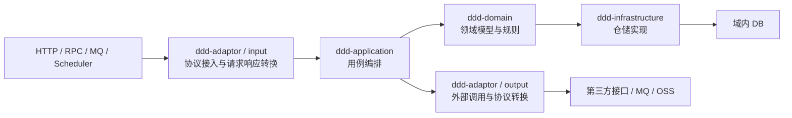

# Java DDD 公共代码规范模板

这是一个可运行的 Java DDD 参考工程，用 `Ddd*` 作为中性占位名称，展示模块边界、五种调用模式、统一结果与分层错误处理规范。

真实项目应以领域语言替换 `Ddd` 前缀，例如将 `DddWriteApplication` 替换为 `OrderWriteApplication`；不得把本工程的表名、接口路径或中性模型机械复制到生产项目。

## 快速验证

```bash
mvn clean test
```

工程使用 JDK 17、Spring Boot 3.x、Maven、MyBatis-Plus 与 H2。启动模块为 `ddd-start`，测试会覆盖写、域内读、规则计算、纯计算、外部读和幂等重放链路。

## Maven 模块

根工程 `ddd` 只聚合模块并集中管理版本。当前共有 8 个 Maven module：

| 模块 | 职责 | 允许依赖 / 关键约束 |
|---|---|---|
| `ddd-common` | 通用协议：`Result<T>`、`ErrorCode`、`BaseException`。 | 不依赖 Spring、HTTP、数据库或第三方协议。 |
| `ddd-client` | 对外协议 DTO：`request`、`response`；未来有 RPC 时在这里声明二方包接口。 | 可依赖 `ddd-common`；禁止依赖 `ddd-model` 和业务实现模块。 |
| `ddd-model` | 项目内部稳定数据对象（`XXDO`），如领域服务和 output adaptor 返回的 `DddWriteDO`、`DddExternalReadDO`。 | 不承载领域行为、外部协议或持久化映射。 |
| `ddd-domain` | 聚合、实体、值对象、领域参数、领域服务、仓储端口及领域输出 DO。 | 不依赖 Spring/Jakarta/MyBatis；只依赖 `ddd-common`、`ddd-model`。 |
| `ddd-application` | 用例编排、`command`、`param`、`result`、assembler 和外部能力端口。 | 依赖 domain、model、common；不得向 Controller 返回领域模型。 |
| `ddd-infrastructure` | MyBatis-Plus Mapper、PO、基础仓储和领域仓储实现。 | 依赖 domain、common；禁止自定义 SQL。 |
| `ddd-adaptor` | HTTP input/output 防腐层、assembler、converter、异常映射与外部协议模型。 | 依赖 application、client、model、common。 |
| `ddd-start` | Spring Boot 启动、模块装配、领域服务扫描、Mapper 扫描、日志、schema 与集成测试。 | 只负责组装，业务模块不得反向依赖。 |

下图按运行时调用方向从左到右展示。`input` 和 `output` 同属 `ddd-adaptor` Maven module，但职责和方向不同，因此拆为两个节点。



`ddd-client` 提供 input 使用的外部 DTO；`ddd-model` 承接 DomainService 和 output adaptor 返回的内部 DO；`ddd-common` 是 `ddd-client`、`ddd-domain`、`ddd-application`、`ddd-infrastructure`、`ddd-adaptor` 共用的基础依赖，提供 `Result<T>`、`ErrorCode`、`BaseException`。这三者是横向支撑模块，因此不在主调用链上重复连线。

运行时依赖注入不改变编译依赖方向：`ddd-infrastructure` 实现 domain 中声明的仓储端口，再由 `ddd-start` 装配到领域服务。

## 当前包结构

```text
ddd-common
└── com.ddd.common
    ├── error/{ErrorCode, BaseException}
    └── result/Result

ddd-client
└── com.ddd.client.ddd/{request,response}

ddd-model
└── com.ddd.model.ddd/{DddWriteDO,DddCalculateDO,DddRuleCalculateDO,DddExternalReadDO}

ddd-domain
└── com.ddd.domain
    ├── annotation/DomainService
    └── ddd
        ├── exception/{DomainErrorCode, DomainException}
        ├── model/{aggregate,entity,param,value}
        ├── repository
        └── service

ddd-application
└── com.ddd.application
    ├── exception/ApplicationErrorCode
    └── ddd
        ├── adaptor/DddOutputAdaptor
        ├── assembler
        ├── command
        ├── param
        ├── result
        └── service

ddd-infrastructure
└── com.ddd.infrastructure
    ├── exception/{InfrastructureErrorCode, InfrastructureException}
    ├── {DddBaseMapper,DddBaseRepository}
    └── ddd
        ├── mysql/{mapper,pojo}
        └── repository

ddd-adaptor
└── com.ddd.adaptor
    ├── common/ApiExceptionHandler
    ├── exception/{AdaptorErrorCode, AdaptorException}
    └── ddd
        ├── input/{DddController,assembler}
        └── output/{converter,model,DddOutputAdaptorImpl}

ddd-start
└── com.ddd.start
    ├── Application
    ├── config/{database,domain}
    └── resources/{application.yml,logback-spring.xml,schema.sql}
```

## 分层职责与调用约定

### adaptor

- `input`：HTTP Controller 只做协议校验、`request/path → command` 转换、调用一个 Application、`result → response` 转换。
- `output`：直接接收 Application Command，通过 converter 转为 adaptor 私有的第三方请求，调用第三方 HTTP/RPC/MQ/OSS 等能力，再转换为 `ddd-model` 的内部 DO。
- `ApiExceptionHandler` 只处理未被主调用边界转换的 HTTP 校验异常和兜底异常。
- 当前 Controller 不需要接口；未来提供 RPC 二方包时，在 `ddd-client` 声明契约，由 `adaptor/input` 实现。

### application

- 只编排用例，保留 `command`、`param`、`result`，不持有领域状态。
- `DddApplicationAssembler` 统一处理 `Command → Domain Param`、`Aggregate/XXDO → Application Result`；Application Service 不直接创建领域 Param，也不手写字段转换。
- 调用 DomainService 或 domain 的 repository 端口；调用外部能力时，只依赖 Application 自己声明的 `DddOutputAdaptor`。
- 任一跨 Application 边界输入均使用 `XXCommand`，即使只有一个标识；Application 通过 assembler 将 Command 组装为 Domain `XXParam`。OutAdaptor 没有额外调用语义时直接接收 Application Command。
- 成功时把 `Result<XXDO>` 转换为 Application Result；不得让 Controller 接触 Aggregate、Entity、Value Object 或 `XXDO`。

### domain

- 是领域模型核心；不引用 Spring、Jakarta、MyBatis-Plus 或外部协议类型。
- `DddAggregate` 只持有 `DddEntity` 根实体；根实体持有 id、当前值、版本和 `DddOperationEntity` 子实体，并完成状态修改。
- DomainService 只通过 Aggregate 的语义方法协作根实体，例如 `findOperation`、`confirm`、`currentValue`，不得写 `aggregate.entity().xxx()` 进行过程式编排。
- `repository` 是领域端口：查询返回 Aggregate，保存返回 `Boolean`，不返回 `Optional`。

### infrastructure

- 使用 `DddBaseRepository → MyBatis-Plus CrudRepository` 复用基础 CRUD；Mapper 继承 `BaseMapper`。
- Mapper 不写 XML 或 `@Select/@Insert/@Update/@Delete` 自定义 SQL；复杂关联由领域与应用逻辑编排。
- `DddRepositoryImpl` 保存完整聚合快照；`ddd_data` 是主聚合演示表，`entities_json` 仅用于本模板说明实体快照恢复，不是生产表设计建议。
- `DddRuleRepositoryImpl` 从独立 `ddd_rule` 表恢复规则聚合；运行环境不预置规则数据。

## 统一 Result 与异常规范

所有层使用 `ddd-common` 的 `Result<T>`：

```text
success = true   → code=SUCCESS，data 为成功数据
success = false  → code/message 为本项目内部错误信息，data=null
```

错误码由错误产生模块定义为枚举，均实现 `ErrorCode`：

| 模块 | 错误码 | 异常类型 | 使用方式 |
|---|---|---|---|
| domain | `DomainErrorCode` | `DomainException` | Value、Entity、Aggregate、Repository 实现可抛出；DomainService 公开入口捕获、记录并转为 `Result`。 |
| application | `ApplicationErrorCode` | 无额外异常子类 | 用例组装或未预期处理失败时返回应用错误码。 |
| infrastructure | `InfrastructureErrorCode` | `InfrastructureException` | JSON 快照等基础设施内部错误向上携带；由领域服务公开边界转为 Result。 |
| adaptor | `AdaptorErrorCode` | `AdaptorException` | 外部调用或协议转换失败；OutAdaptor 公开入口捕获、记录并转为 `Result`。 |

同一异常不得在每层重复 `try-catch` 和重复打印。私有方法、Entity、Aggregate 只抛出带内部错误码的异常；DomainService 与 OutAdaptor 的主入口记录一次根因日志。已预期的业务失败目前以 `HTTP 200 + success=false` 返回，HTTP 参数校验与未兜底异常则返回 400/500。

## 五种参考调用链

| 模式 | 入口 | 当前调用链 | 状态变化 |
|---|---|---|---|
| 写模式 | `POST /api/ddd/write` | Controller → `DddWriteApplication` → `DddWriteDomainService` → Aggregate → Repository | 有；由根 Entity 确认操作并维护版本。 |
| 域内读 | `GET /api/ddd/{id}` | Controller → `DddReadApplication` → Repository → Aggregate | 无。 |
| 规则+计算 | `POST /api/ddd/rule` | Controller → `DddRuleApplication` → `DddRuleDomainService` → RuleRepository → RuleAggregate | 无。 |
| 纯计算 | `POST /api/ddd/calculate` | Controller → `DddCalculateApplication` → `DddCalculateDomainService` | 无，不查询仓储、不创建聚合。 |
| 外部读 | `GET /api/ddd/{id}/external` | Controller → `DddExternalReadCommand` → `DddExternalReadApplication` → `DddOutputAdaptor` → converter → 第三方请求/响应 → `DddExternalReadDO` | 无。 |

## 代码编写规则

- 所有公开类型、字段和对外契约使用中文多行 Javadoc，并带 `@author AIGenerator`。
- 流程型方法必须拆成清晰的局部步骤，使用 `// 1.`、`// 2.` 编号说明“获取/组装 → 调用 → 解析/转换”；不要写嵌套的一行调用链。
- 方法或构造器签名仅在超过 120 字符时换行；Java 源码行宽不超过 120 字符。
- Spring 管理的组件统一采用单一构造器注入；domain 通过无 Spring 依赖的 `@DomainService` 标记和 `ddd-start` 扫描装配。
- `XXPO` 仅用于 infrastructure 中的数据库映射；`XXDO` 仅用于项目内部的无行为数据传递，DomainService 和 OutAdaptor 的公开成功结果统一为 `Result<XXDO>`；Application 必须转换为自己的 `XXResult`。
- 任何跨 Application、DomainService 或 OutAdaptor 公开边界的入参都使用 `XXCommand` 或 `XXParam` 对象；禁止传递裸 `String`、数字、布尔值或其他基本类型。Application assembler 将 Command 转为 Domain Param；OutAdaptor 无额外参数语义时直接接收 Application Command，再由 converter 转为第三方请求对象。
- 所有版本在根 `pom.xml` 管理，子模块 dependency/plugin 不声明版本（Maven 必需的 parent version 除外）。
- 不创建无真实用途的 Controller、RPC 接口、Configuration 或内存式仓储；按真实需求裁剪模块与调用模式。

## 文档与交接

`AI/input` 保存用户输入、规范和附件索引；`AI/output` 保存需求、产品、技术、计划、自测、决策与交接记录；`.ai-delivery` 保存机器状态。后续修改模板时，应同步更新技术方案、开发计划、自测报告与交接记录。
