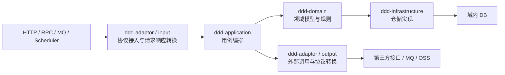

# Java DDD 公共代码规范模板

这是一个可运行的 Java DDD 参考工程，用 `Ddd*` 作为中性占位名称，展示模块边界、五种调用模式、统一结果与分层错误处理规范。

真实项目应以领域语言替换 `Ddd` 前缀。先按业务职责命名领域对象，例如订单领域服务可为 `OrderDomainService`；写入、读取等模式由用例、公开动作和参数表达。`DddWriteApplication`、`DddWriteDomainService`等名称仅标记本参考工程的教学路径，不能机械替换为真实项目的类名后缀；也不得把本工程的表名、接口路径或中性模型复制到生产项目。

## 快速验证

```bash
mvn clean test
```

工程使用 JDK 17、Spring Boot 3.x、Maven、MyBatis-Plus 与 H2。启动模块为 `ddd-start`，测试会覆盖写、域内读、规则计算、纯计算、外部读和幂等重放链路。

## 项目版本与发布 POM

项目版本只在根 `pom.xml` 的 `properties/revision` 中定义，当前为 `0.0.1-SNAPSHOT`。根 `version` 与所有子模块的 `parent/version` 使用 `${revision}`；内部模块依赖版本仍由根以 `${project.version}` 管理。后续升级只改根 revision，无须逐个修改子模块。

也可以临时覆盖版本，不改文件：

```bash
mvn clean package -Drevision=0.0.2-SNAPSHOT
```

根 POM 配置继承的 Flatten 插件，在 `process-resources` 阶段生成 `.flattened-pom.xml`，供 Maven 3 的 `install/deploy` 使用，解析 `${revision}` 等 CI 版本占位符。`resolveCiFriendliesOnly` 保留其他 POM 结构；源码 `pom.xml` 不被改写。生成文件被 Git 忽略，`mvn clean` 自动清理；发布前从根执行完整生命周期，不直接跳过生成步骤。外部 Spring Boot parent 的版本仍在根独立管理，不随项目 revision 改变。

## Maven 模块

根工程 `ddd` 只聚合模块并集中管理版本。当前共有 8 个 Maven module：

| 模块 | 职责 | 允许依赖 / 关键约束 |
|---|---|---|
| `ddd-common` | 通用协议：`Result<T>`、`ErrorCode`、`BaseException`。 | 不依赖 Spring、HTTP、数据库或第三方协议。 |
| `ddd-client` | 对外协议 DTO：`request`、`response`；未来有 RPC 时在这里声明二方包接口。 | 可依赖 `ddd-common`；禁止依赖 `ddd-model` 和业务实现模块。 |
| `ddd-model` | 项目内部稳定数据对象（`XXDO`），如领域服务和 output adaptor 返回的 `DddWriteDO`、`DddExternalReadDO`。 | 不承载领域行为、外部协议或持久化映射。 |
| `ddd-domain` | 聚合、实体、值对象、领域参数、领域服务、仓储端口及领域输出 DO。 | 不依赖 Spring/Jakarta/MyBatis；只依赖 `ddd-common`、`ddd-model`。 |
| `ddd-application` | 用例编排、`command`、`param`、`result`、assembler 和外部能力端口。 | 依赖 domain、model、common；不得向 Controller 返回领域模型。 |
| `ddd-infrastructure` | MyBatis-Plus Mapper、PO、基础仓储和领域仓储实现。 | 依赖 domain、common；禁止自定义 SQL。 |
| `ddd-adaptor` | HTTP input/output 防腐层、assembler、converter、异常映射与外部协议模型。 | 依赖 application、client、model、common。 |
| `ddd-start` | Spring Boot 启动、模块装配、领域服务扫描、Mapper 扫描、日志、schema 与集成测试。 | 显式声明本服务运行的内部模块；只负责组装，业务模块不得反向依赖。 |

`ddd-start/pom.xml` 是显式装配清单：当前完整模板直接声明其余七个模块，版本统一由根 POM 管理。这不表示 start 要调用每一层的业务类，只表示这些模块明确随服务参与运行。真实项目按服务边界裁剪，不引入无用途或其他服务模块；测试专用依赖使用 `test` scope。该规则通过 POM/依赖树审查与构建运行验证，不由 Checkstyle 自动校验。

下图按运行时调用方向从左到右展示。`input` 和 `output` 同属 `ddd-adaptor` Maven module，但职责和方向不同，因此拆为两个节点。



`ddd-client` 提供 input 使用的外部 DTO；`ddd-model` 承接 DomainService 和 output adaptor 返回的内部 DO；`ddd-common` 是 `ddd-client`、`ddd-domain`、`ddd-application`、`ddd-infrastructure`、`ddd-adaptor` 共用的基础依赖，提供 `Result<T>`、`ErrorCode`、`BaseException`。这三者是横向支撑模块，因此不在主调用链上重复连线。

运行时依赖注入不改变编译依赖方向：`ddd-infrastructure` 实现 domain 中声明的仓储端口，再由 `ddd-start` 装配到领域服务。

## 当前包结构

```text
ddd-common
└── com.ddd.common
    ├── error/{ErrorCode, BaseException}
    └── result/Result

ddd-client
└── com.ddd.client.ddd/{request,response}

ddd-model
└── com.ddd.model.ddd/{DddWriteDO,DddCalculateDO,DddRuleCalculateDO,DddExternalReadDO}

ddd-domain
└── com.ddd.domain
    ├── annotation/DomainService
    └── ddd
        ├── exception/{DomainErrorCode, DomainException}
        ├── model/{aggregate,entity,param,value}
        ├── repository
        └── service

ddd-application
└── com.ddd.application
    ├── exception/ApplicationErrorCode
    └── ddd
        ├── adaptor/DddOutputAdaptor
        ├── assembler
        ├── command
        ├── param
        ├── result
        └── service

ddd-infrastructure
└── com.ddd.infrastructure
    ├── exception/{InfrastructureErrorCode, InfrastructureException}
    ├── {DddBaseMapper,DddBaseRepository}
    └── ddd
        ├── mysql/{mapper,pojo}
        └── repository

ddd-adaptor
└── com.ddd.adaptor
    ├── common/ApiExceptionHandler
    ├── exception/{AdaptorErrorCode, AdaptorException}
    └── ddd
        ├── input/{controller,assembler}
        └── output/{converter,model,DddOutputAdaptorImpl}

ddd-start
└── com.ddd.start
    ├── Application
    ├── config/{database,domain}
    └── resources/{application.yml,logback-spring.xml,schema.sql}
```

## 分层职责与调用约定

### adaptor

- `input`：HTTP Controller 只做协议校验、`request/path → command` 转换、调用一个 Application、`result → response` 转换；Controller 与 Assembler 分别位于同级`input.controller`、`input.assembler`。listener、scheduler等输入协议按业务域建立同级职责包。
- `@Scheduled`是时间输入协议，只能位于业务的`input.scheduler`；它只触发Application公开的业务动作并处理本轮失败，不能直接访问Repository、DomainService或第三方SDK。HTTP/SSE Controller不能兼任Scheduler。
- `output`：直接接收 Application Command，通过 converter 转为 adaptor 私有的第三方请求，调用第三方 HTTP/RPC/MQ/OSS 等能力，再转换为 `ddd-model` 的内部 DO。
- `ApiExceptionHandler` 只处理未被主调用边界转换的 HTTP 校验异常和兜底异常。
- 当前 Controller 不需要接口；未来提供 RPC 二方包时，在 `ddd-client` 声明契约，由 `adaptor/input` 实现。

### application

- 只编排用例，保留 `command`、`param`、`result`，不持有领域状态。
- 一个 Application Service 只表达并实现一个可从类名理解的业务动作；不建立`Write`、`Operations`、`Actions`、`UseCase`或`Repositories`等泛化聚合/转发类。多动作协议由受控策略或注册表分派到具体动作服务。
- `DddApplicationAssembler` 统一处理 `Command → Domain Param`、`Aggregate/XXDO → Application Result`；Application Service 不直接创建领域 Param，也不手写字段转换。
- 调用 DomainService 或 domain 的 repository 端口；调用外部能力时，只依赖 Application 自己声明的 `DddOutputAdaptor`。
- 任一跨 Application 边界输入均使用 `XXCommand`，即使只有一个标识；调用 DomainService 时通过 assembler 组装 Domain `XXParam`。OutAdaptor 无额外调用语义时直接接收 Command；按 ID 调用 Repository 时直接提取标识，不创建领域 Param。
- 成功时把 `Result<XXDO>` 转换为 Application Result；不得让 Controller 接触 Aggregate、Entity、Value Object 或 `XXDO`。

### domain

- 是领域模型核心；不引用 Spring、Jakarta、MyBatis-Plus 或外部协议类型。
- `DddAggregate` 只持有 `DddEntity` 根实体；根实体持有 id、当前值、版本和 `DddOperationEntity` 子实体，并完成状态修改。
- DomainService 只通过 Aggregate 的语义方法协作根实体，例如 `findOperation`、`confirm`、`currentValue`，不得写 `aggregate.entity().xxx()` 进行过程式编排。
- `repository` 是领域端口：查询返回 Aggregate，保存返回 `Boolean`，不返回 `Optional`。

### Repository 入参及分页约定

- Repository 是服务入口对象入参规则的例外：按 ID 查询、删除可接收 `String`、`Long` 等标识类型，按 IDs 批量操作接收标识集合；不复用 DomainService 的 `XXParam`。
- 新增、修改接收完整 Aggregate，修改依据聚合标识及版本定位；当前 `save` 保留已有新增/更新语义。
- 分页接收 domain 自有的分页查询对象（页码、页大小、筛选和排序），返回 domain 自有的分页结果（总数、页码、页大小、Aggregate 列表）；不得让 MyBatis-Plus `Page/IPage` 或 PO 越过仓储边界。
- 普通分页由 Application 调用仓储，再经 assembler 转为 Application Result；涉及领域规则时由 DomainService 编排，仍使用同一域内分页契约。影响总数的筛选必须在分页前完成，不能查一页后过滤却沿用未过滤总数。
- infrastructure 负责域内分页对象与 MyBatis-Plus 分页对象的双向转换，并校验页大小、排序白名单。当前尚无分页用例，以上为后续代码生成约定，未新增占位分页实现。

### infrastructure

- 使用 `DddBaseRepository → MyBatis-Plus CrudRepository` 复用基础 CRUD；Mapper 继承 `BaseMapper`。
- Mapper 不写 XML 或 `@Select/@Insert/@Update/@Delete` 自定义 SQL；复杂关联由领域与应用逻辑编排。
- `DddRepositoryImpl` 保存完整聚合快照；`ddd_data` 是主聚合演示表，`entities_json` 仅用于本模板说明实体快照恢复，不是生产表设计建议。
- `DddRuleRepositoryImpl` 从独立 `ddd_rule` 表恢复规则聚合；运行环境不预置规则数据。

## 统一 Result 与异常规范

所有层使用 `ddd-common` 的 `Result<T>`：

```text
success = true   → code=SUCCESS，data 为成功数据
success = false  → code/message 为本项目内部错误信息，data=null
```

错误码由错误产生模块定义为枚举，均实现 `ErrorCode`：

| 模块 | 错误码 | 异常类型 | 使用方式 |
|---|---|---|---|
| domain | `DomainErrorCode` | `DomainException` | Value、Entity、Aggregate、Repository 实现可抛出；DomainService 公开入口捕获、记录并转为 `Result`。 |
| application | `ApplicationErrorCode` | 无额外异常子类 | 用例组装或未预期处理失败时返回应用错误码。 |
| infrastructure | `InfrastructureErrorCode` | `InfrastructureException` | JSON 快照等基础设施内部错误向上携带；由领域服务公开边界转为 Result。 |
| adaptor | `AdaptorErrorCode` | `AdaptorException` | 外部调用或协议转换失败；OutAdaptor 公开入口捕获、记录并转为 `Result`。 |

同一异常不得在每层重复 `try-catch` 和重复打印。私有方法、Entity、Aggregate 只抛出带内部错误码的异常；DomainService 与 OutAdaptor 的主入口记录一次根因日志。已预期的业务失败目前以 `HTTP 200 + success=false` 返回，HTTP 参数校验与未兜底异常则返回 400/500。

## 五种参考调用链

| 模式 | 入口 | 当前调用链 | 状态变化 |
|---|---|---|---|
| 写模式 | `POST /api/ddd/write` | Controller → `DddWriteApplication` → `DddWriteDomainService` → Aggregate → Repository | 有；由根 Entity 确认操作并维护版本。 |
| 域内读 | `GET /api/ddd/{id}` | Controller → `DddReadApplication` → Repository → Aggregate | 无。 |
| 规则+计算 | `POST /api/ddd/rule` | Controller → `DddRuleApplication` → `DddRuleDomainService` → RuleRepository → RuleAggregate | 无。 |
| 纯计算 | `POST /api/ddd/calculate` | Controller → `DddCalculateApplication` → `DddCalculateDomainService` | 无，不查询仓储、不创建聚合。 |
| 外部读 | `GET /api/ddd/{id}/external` | Controller → `DddExternalReadCommand` → `DddExternalReadApplication` → `DddOutputAdaptor` → converter → 第三方请求/响应 → `DddExternalReadDO` | 无。 |

## 开发规范与 Maven 门禁

统一生效规范为 [19 Java DDD开发规范](AI/output/19%20Java%20DDD开发规范.md)。它按主题整理最终约定，明确必须项、例外、生产适配，以及 Checkstyle/评审各自能保障的范围；历史沟通仅保留追溯，不作为并列规则。

规范1.6增加DEL-004/005：整份技术方案生成后必须主动反思推演可行性，回改发现的矛盾并记录证据及待验证条件；方案和计划默认不估工时/人天，实际排期由当事人依据当前情况决定。这两项为人工评审规则，不能以Checkstyle通过替代。

项目根携带 [checkstyle.xml](checkstyle.xml)，根 POM 将 Checkstyle 的 `check` 绑定到 `validate`，各 module 继承：

```bash
mvn validate
mvn clean compile
mvn clean test
mvn clean package
```

上述生命周期命令在编译前自动检查生产源码，违规构建失败。只在 pluginManagement 中声明插件不会生效，因此门禁实际声明在根 build/plugins；依赖、插件和 Checkstyle 引擎版本仍由根集中管理。

当前自动检查格式、类型命名后缀、公开入口输入/输出及参数名形式、Javadoc、字段注入、常见框架 import 与 SQL 注解。它不验证完整 Maven 依赖图、真实领域内聚、转换语义、所有 SQL 调用、业务日志或功能/性能。测试源码、生成源码和 scripts 不在本版 Checkstyle 范围内；完整边界见规范第 10 节。

接口与实现类的公开方法注释统一由 Maven Checkstyle 门禁检查，不再维护独立的接口注释检查脚本。Spring 扫描组件的单一纯依赖注入构造器（DOC-005）及构造器注入依赖字段（DOC-006）不写重复注释；业务属性、常量和日志字段仍保留说明；含校验/初始化/转换逻辑的构造器、Controller 业务方法及接口契约仍写多行中文 Javadoc。豁免分别针对窄范围 MissingJavadocMethod/JavadocVariable，不全局关闭构造器检查。

Checkstyle 的自定义诊断使用 ASCII 英文并保留规则 ID，内置语言固定 en/US（MAV-007）；Java 源码/配置/中文注释仍为 UTF-8。例：`NAM-TYPE-PARAM: Request/Command parameter name must match its full type in lowerCamelCase` 表示参数名应与完整类型对应；`DddRuleRequest` 必须命名为 `dddRuleRequest`，不能改为 `dddRuleRequestParam`。这是门禁输出的编码兼容策略，不代表全局修改 IntelliJ 控制台设置。

使用 solo 的 Java DDD 模板生成新项目时，AI 在根 POM 建好、正式编码前自动运行 Skill 的安装器，携带相同门禁与规范快照。配置与项目脱离 Skill 也可独立构建，不需要用户每次手动补 checkstyle.xml；已有冲突配置会保留并要求显式协调。

## DDD 与 AI 框架的通用边界

本参考工程不预置 LangChain4j、LangGraph4j、向量库或具体模型厂商依赖；这避免把教学用的基础 DDD 链路误当作任意 AI 项目的固定实现。需要 AI 能力时，仍先按业务域划分：Application 的`<业务>.adaptor`声明对话、意图识别、结构化生成或事实查询等业务语义端口；所属业务的 adaptor output 与 start 承载`@AiService`、提示词、模型流式调用、嵌入和供应商装配。端口的 Command、Result 与中间模型不得暴露框架或厂商类型。

存在真实多步骤状态、校验和路由时，Graph 位于 Application 作为业务编排：Node 调用 OutAdaptor 获取外部能力、调用 Repository 查询内部数据、调用 DomainService 执行确定性规则；OutAdaptor 不调用 Domain。普通单次对话或少量明确分支由 Application 直接路由，不为使用 Graph 制造节点。RAG 同时使用关系库和向量库时，前者保存文档生命周期、分块元数据和向量引用，后者保存 embedding 与检索索引；两者的删除、重建、一致性和来源说明由具体业务方案定义。

具体规则以[19 Java DDD开发规范](AI/output/19%20Java%20DDD开发规范.md)中的MOD-011、DDD-014～016、AI-001～005为准。本工程的`Ddd*`类、H2 schema、`ddd_data`表和接口路径始终只是教学占位，不能成为其他项目的默认命名或数据设计。

## 文档与交接

`AI/input` 保存用户输入、规范和附件索引；`AI/output` 保存需求、产品、技术、计划、自测、决策与交接记录；`.ai-delivery` 保存机器状态。后续修改模板时，应同步更新技术方案、开发计划、自测报告与交接记录。

## SRC-043历史工程边界修订（2026-09-17）

Java规范1.7：Controller、Application、DomainService及OutAdaptor实现主入口必须各自完整try-catch，禁止向上抛出、throws和catch重抛；事务完成/回滚后才转换结果，提交失败也必须捕获。默认Checkstyle新增ERR-BOUNDARY-CATCH/THROWS/RETHROW，错误语义与事务仍需专项验证。有前端时自动建立同级`<项目名>-app`独立项目；AI设计/接口/数据库说明与证据归AI/output，正式迁移、源码、测试和运行脚本保留构建位置。参考快照1.5同步当前ddd源码与新增失败回归。

## 当前业务代码质量约束（2026-09-18）

Java规范1.8：业务方法含私有辅助、回调按真实职责写中文编号步骤，实体持有初始化/校验/变化规则、聚合提供语义协作；迭代前后检查完整链路，复用职责并清理失效或重复代码。根validate默认执行Checkstyle及scripts/JavaBusinessQuality.java，后者扫描编号、45语句节点阈值与有限领域结构，不能证明注释含义或完整面向对象。独立CR和生产适配仍按流程执行。

## 当前DDD+AI与调度边界（规范1.18）

规范1.18补充技术能力归属业务域、无状态util的使用条件、单动作Application Service、时间输入调度器和AI业务编排边界。`scripts/JavaBusinessQuality.java`新增`QUALITY-SCHEDULER-BOUNDARY`：任何`@Scheduled`落在非adaptor业务scheduler包都会在validate阶段失败。AI、RAG和Graph规则属于真实业务项目的设计约束；本参考工程不伪造模型调用、向量存储或Graph样例来证明这些规则。

```sh
mvn validate
java scripts/JavaBusinessQuality.java . --report AI/output/docs/verification/quality-method-inventory.csv
```

实际范围与证据见[当前开发交付记录](<AI/output/05 开发交付记录.md>)和AI/output/docs/verification/quality-summary.json；旧日志/哈希保留原日期。
