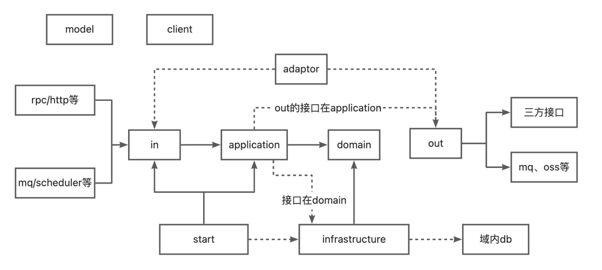
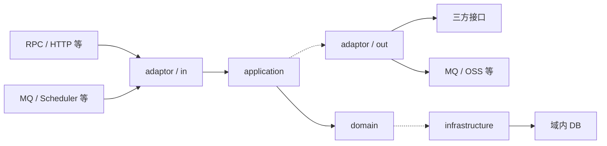

# DDD开发规范
# 分层设计
## 图片模式


## Mermaid模式



## adaptor

分为INPUT和OUTPUT，是防腐层，目的屏蔽外部过来的请求以及当前项目向外部三方接口调用的请求

### input

主要存放Controller、Rpc接口的实现，使用自己内部类模型来接收参数以及响应到外部自己的Result，一般此层方法里只做对application层的调用

#### assembler

存放input代码逻辑里需要转换的响应或请求类

### output

主要用于调用外部三方接口以及外部中间件服务，接收的结果用自己的内部模型进行转换

#### converter

存放output代码逻辑里需要转换的响应或请求类

## application

业务编排层。核心就是组建每个方法里应该执行的逻辑步骤。此层依赖domain层

1、若简单逻辑查询外部，则需要在此层建设adapter层的接口，让output来实现此接口，从而可以让application调用output的接口来访问外部接口，达到简单的外部查询功能和响应转换

2、若简单逻辑查询自己域内，则可以直接调用doamin层的infrastructure接口，此接口实现是在infrastructure，从而达到调用db的能力

3、若是有写的操作，则需要调用domainservice，但domainservice里的逻辑实际上也是编排逻辑，真正的核心代码应该在聚合根、实体里

4、若仅仅是纯计算模式，则需要调用domainservice里，并且核心逻辑都在domainservice里，比如算数类、过滤类

## client

本质上是对外暴露服务和接收外部请求需要定义的内部请求与响应，禁止依赖model

## domain

领域层，是整个项目的核心所在，此层不能依赖外部三方任何框架，包括spring，若碰到spring注入问题，可通过自定义注解和包扫描来配置解决，此配置可放到start层

## infrastructure

仓储层，仅存放当前项目链接的数据库持久化等信息，可使用mybatis-plus简化大部分写法，也可通过mybatis自动生成，不允许自定义sql写入，所有表关联通过业务逻辑来处理保证

## model

自身项目使用，domain、application、adaptor、infrastructure均可依赖，但client禁止依赖

## start

项目启动层，配置等相关信息，domain不能依赖spring，所以domain层使用自定义注解方式来解决，此配置可放到这里

# 项目包结构

```
adaptor
  xx业务
    input
      assembler
      scheduler
      listener
    output
      converter
application
  xx业务
    adaptor
    service
client
  xx业务
    request
    response
domain
  xx业务
    model
      aggregate
      entity
      value
      param
    service
    repository
infrastructure
  xx业务
    mysql
      mapper
      pojo
    repository
model
  xx业务
start
  aop
  config
```

# 开发模式

## 概览

|   |   |   |   |   |
|---|---|---|---|---|
|模式|聚合根/实体|业务逻辑位置|状态修改|典型场景|
|写模式|有|聚合根/实体方法|是|订单创建、状态变更|
|读模式|有（作为数据载体）|无（仅数据转换）|否|订单查询|
|规则+计算模式|有|聚合根/实体方法|否|补贴规则匹配与计算|
|纯计算模式|无|DomainService|否|搜索控制、费用计算、视图渲染|

## 判断依据

```
场景分析
  是否需要修改数据状态
    是-->写模式。有聚合根/实体，核心逻辑在聚合根方法中，方法会修改实体状态
    否-->继续判断
      是否有业务逻辑需要处理
        否-->读模式
          是否查询外部
          是-->调用adaptor的output
          否-->调用domain的repository接口
        是-->继续判断
          业务逻辑是否基于规则
            是-->规则+计算。规则为聚合根建模，通过聚合根的方法来调用，不修改实体状态
            否-->纯计算。逻辑在domainservice里，根据入参进行计算。
```

## 调用链路

### 写模式
```
inputAdaptor-->application-->domainservice-->aggregate-->repository
```

### 读模式
```
inputAdaptor-->application-->repository
```

### 读外部
```
inputAdaptor-->application-->outputAdaptor
```

### 规则+计算模式
```
inputAdaptor-->application-->domainservice-->repository-->聚合根
```

### 纯计算模式
```
inputAdaptor-->application-->domainservice
```